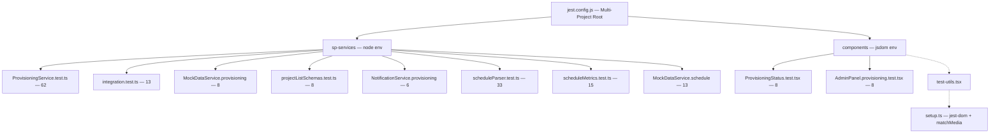

**CLAUDE.md — HBC Project Controls Blueprint (Lean Edition)**

**Performance Rule (Critical)**
This file must stay under 40,000 characters. Never allow it to grow large again. When it approaches the limit, archive older content to CLAUDE_ARCHIVE.md.

**Update Rules (Mandatory)**
Update this file at these specific intervals:
- After every completed data service chunk (SP-8, SP-9, etc.) → update §7 Service Methods Status and §15 Current Phase Status
- After any major architecture or pattern change → update relevant sections (§4, §16)
- After adding new models, enums, or important constants → update §6 Data Models or §13 Constants if critical
- Every 3–4 chunks or when the file exceeds 35k characters → prune non-essential history to CLAUDE_ARCHIVE.md
- Always keep the file focused on: current status, active rules, recent chunks, and live references.

For full historical phase logs (SP-1 through SP-7), complete 221-method table, old navigation, and detailed past pitfalls → see **CLAUDE_ARCHIVE.md**.

**Last Updated:** 2026-02-18 — ECharts Migration (Recharts → ECharts ^5.6 across 6 files, 553 tests passing) + SPFx 1.22.2 upgrade (rush-stack-compiler-5.3, future-proof scaffolding).

**MANDATORY:** After every code change that affects the data layer, update the relevant sections before ending the session.

---

## §0 Development Workflow Rules

- **After any meaningful code change**, run `/verify-changes` and show the full output before concluding the task.
- **Never mark work complete** until verification passes (TypeScript, ESLint, tests).
- **Before commits and PRs**, run `/verify-full-build` to confirm the full production build succeeds.
- **After completing a data service chunk**, run `/review-chunk` to scan real stub counts and generate CLAUDE.md updates.
- **Available commands**: `/verify-changes` (quick), `/verify-full-build` (full), `/status` (overview), `/permissions` (allowlist), `/sp-progress` (stub scan), `/review-chunk` (post-chunk).

### Command Evolution Guidelines
- **Add** a command when: a workflow repeats 3+ times/week, manual execution is error-prone, or it has clear success/failure criteria.
- **Modify** a command when: user feedback indicates friction, codebase structure changes, or new requirements emerge.
- **Retire** a command when: unused for 3+ months, superseded by a better command, or its phase is complete.

---

## §1 Tech Stack & Build (Current)

- **Framework**: SPFx 1.22.2 + React 18.2.0 + Fluent UI v9 (makeStyles + tokens)
- **Data Layer**: `@hbc/sp-services` monorepo package (shared library)
- **Charting**: Apache ECharts ^5.6.x + echarts-for-react ^3.x (replaced Recharts Feb 2026). Tree-shaking via `echarts/core`. Wrapper: `HbcEChart` (`shared/`). Theme: `hbcEChartsTheme.ts`.
- **Key Commands**:
  - `npm run dev` → Standalone dev server + RoleSwitcher
  - `gulp serve --nobrowser` → SPFx workbench
  - `npm run build` → Full production build (lib → app)
  - `npm run test:ci` → Jest coverage

---

## §4 Core Architecture Patterns (Active)

- **Data Service**: `IDataService` (244 methods) → `MockDataService` (full) + `SharePointDataService` (244/244 — COMPLETE)
- **Data Mart**: Denormalized 43-column hub list aggregating 8+ project-site lists; fire-and-forget sync from hooks; `useDataMart` hook with SignalR refresh
- **Hooks**: Feature-specific hooks call `dataService` methods in `useCallback`
- **RBAC**: `resolveUserPermissions` → `PermissionGate` / `RoleGate` / `FeatureGate`
- **Styling**: `makeStyles` (structure) + minimal inline (dynamic) + Fluent tokens + `HBC_COLORS`
- **Routing**: `HashRouter` + `React.lazy()` + `Suspense` (40 lazy-loaded pages)
- **Charts**: `HbcEChart` wrapper → `EChartsOption` object (always `useMemo`) → ECharts canvas. Theme injected once via `registerHbcTheme()`. `onEvents` for drill-down. `ResizeObserver` handles responsive resize.
- **Audit**: Fire-and-forget `this.logAudit()` with debounce
- **Cross-site Access**: `_getProjectWeb()` helper in SharePointDataService

---

## §7 Service Methods Status (Live)

**Total methods**: 244
**Implemented**: 244
**Remaining stubs**: 0 — DATA LAYER COMPLETE

**Last Completed**:
- Constraints Health Widget (Feb 17): `getAllConstraints()` hub-level cross-project query → 244/244
- Permits Log (Feb 17): 4 new methods → 243/243
- Constraints Log (Feb 17): 4 new methods → 239/239
- Schedule Module (Feb 17): 6 new methods → 235/235
- Provisioning Ops (Feb 16): 8 new methods → 229/229
- Data Mart (Feb 15): 4 methods (`syncToDataMart`, `getDataMartRecords`, `getDataMartRecord`, `triggerDataMartSync`) → 225/225
- SP-13 (Feb 15): Action Inbox — 1 method → 221/221
- SP-12 (Feb 15): Help & Support — 6 methods → 220/221
- SP-11 (Feb 15): Performance Monitoring — 3 methods → 214/221
- SP-10 (Feb 15): Scorecard Workflow — 9 methods → 211/221

**Note**: `sendSupportEmail` is a deliberate no-op (requires Graph API not yet available).

---

## §15 Current Phase Status

**Phase COMPLETE**: Permits Log Module — 243/243 methods implemented, 550 total tests.

Full P6-style schedule management with multi-format support:
- **Parsing**: CSV, XER (Primavera P6), XML (MSProject + P6 PMXML) via `parseScheduleFile` dispatcher
- **6 tabs**: Overview (9 KPI cards + EV summary), Activities (advanced filters + ExportButtons), Gantt, Critical Path, **Analysis** (8 Recharts chart sections), Import (format dropdown with auto-detect)
- **Enhanced metrics**: `IScheduleMetrics` extended with `negativeFloatPercent`, `cpiApproximation`, `constraintAnalysis`, `earnedValueMetrics` (BAC/EV/PV/SV/SPI/CPI), `logicMetrics` (relationship types, open ends)
- **Shared computation**: `computeScheduleMetrics()` utility used by hook, MockDataService, and SharePointDataService
- **Caching**: sessionStorage with 5-min TTL, SignalR bypass
- **Charts**: Variance scatter, Float distribution bar, Near-critical horizontal bar, Schedule health radar, Logic metrics pie, Constraint analysis bar, Status donut, Earned value combo
- 6 IDataService methods, feature-gated behind `ScheduleModule` flag

**Constraints Log Module** (Feb 17):
- Full CRUD: `getConstraints`, `addConstraint`, `updateConstraint`, `removeConstraint` (4 methods)
- Model: `IConstraintLog` with 10 categories, Open/Closed status, auto-increment constraintNumber
- UI: ConstraintsLogPage with 4 MetricCards, search/status/category filters, ExportButtons, inline editing
- `daysElapsed` calculated at render time (not stored), overdue detection for open + past-due items
- Hook: `useConstraintLog` with SignalR subscription (`EntityType.Constraint`), computed metrics
- Permissions: `CONSTRAINTS_VIEW`, `CONSTRAINTS_EDIT`, `CONSTRAINTS_MANAGE` (Ops=all 3, Exec/Director=VIEW+EDIT)
- 45 project-site schemas, 12 mock entries across 2 project codes

**Permits Log Module** (Feb 17):
- Full CRUD: `getPermits`, `addPermit`, `updatePermit`, `removePermit` (4 methods)
- Model: `IPermit` with 3 types (PRIMARY/SUB/TEMP), 7 statuses, parent-child relationships via `parentRefNumber`
- UI: PermitsLogPage with 5 MetricCards, search/status/type/location filters, ExportButtons, inline editing
- Grouped by Location (Site/Building/Pool), SUB rows indented, Type badges with color coding
- `daysToExpiry` and `expiringSoon` (30-day window) calculated at render time
- Hook: `usePermitsLog` with SignalR subscription (`EntityType.Permit`), computed metrics (total/active/pending/expired/void/expiringSoon/byType/byLocation)
- Permissions: `PERMITS_VIEW`, `PERMITS_EDIT`, `PERMITS_MANAGE` (Ops=all 3, Exec/Director=VIEW+EDIT)
- 45 project-site schemas, 20 mock entries across 2 project codes

**Next Phase**: Integration testing and deployment readiness.

## §15a Provisioning Workflows

**Feature flags**: `AutoSiteProvisioning` (UI gating), `ProvisioningRealOps` (operation dispatch)

**8 IDataService provisioning operation methods** (229 total):
`createProjectSite`, `provisionProjectLists`, `associateWithHubSite`,
`createProjectSecurityGroups`, `copyTemplateFiles`, `copyLeadDataToProjectSite`,
`updateSiteProperties`, `createList`

**Flow**: Lead GO decision → Job# Request → provisionSite() → executeStep() dispatcher
- `useRealOps=true`: Real PnP.js operations (7-step pipeline)
- `useRealOps=false`: simulateStep() 500ms delay (default)

**Steps**: 1.CreateSite → 2.ProvisionLists(batch/5) → 3.HubAssociate → 4.SecurityGroups → 5.CopyTemplates → 6.CopyLeadData → 7.UpdateLead

**Key files**: `ProvisioningService.ts` (orchestrator), `projectListSchemas.ts` (44 list schemas), `ProvisioningService.test.ts` (62 tests), `ProvisioningService.integration.test.ts` (13 tests), `MockDataService.provisioning.test.ts` (8 tests), `projectListSchemas.test.ts` (8 tests)

**Test coverage** (Feb 16): ProvisioningService.ts — 97.27% stmts, 80.76% branches, 94.73% functions, 98.44% lines. projectListSchemas.ts — 100% all metrics. Total: 92 provisioning-specific tests across 4 suites.

## §15b Test Architecture — Provisioning

**Coverage**: ProvisioningService.ts 97%+ stmts/98%+ lines, projectListSchemas.ts 100%, NotificationService.ts ~65% stmts

**Test Suites** (113 provisioning-related + 61 schedule tests):
- Service (node): ProvisioningService.test.ts (62), integration (13), MockDataService.provisioning (8), schemas (8), NotificationService.provisioning (6)
- Component (jsdom): ProvisioningStatus.test.tsx (8), AdminPanel.provisioning.test.tsx (8)

**Jest config**: Root multi-project — `sp-services` (node) + `components` (jsdom)

**Test utils**: `src/__tests__/test-utils.tsx` — `renderWithProviders` with FluentProvider + MemoryRouter + AppProvider

**Run commands**:
- `npx jest` — all 550 tests across both projects
- `npx jest --selectProjects components` — UI tests only (16)
- `npx jest --selectProjects sp-services` — service tests only (534)

---

## §16 Active Pitfalls & Rules

(Only the most relevant current ones are kept here. Full historical list is in CLAUDE_ARCHIVE.md)

- Always use `columnMappings.ts` — never hard-code column names.
- Call `this.logAudit()` on every mutation.
- Use `_getProjectWeb()` for project-site lists.
- Hub-site reference data (e.g. Division_Approvers, PMP_Boilerplate) uses `this.sp.web`.
- After mutations that affect assemblies, always re-read + re-assemble (e.g. PMP, Monthly Review, Turnover Agenda).
- `Turnover_Estimate_Overviews` is a new SP list — must be provisioned before feature goes live.
- `Project_Data_Mart` is a new hub-site SP list (43 columns) — must be provisioned before Data Mart feature goes live.
- Data Mart sync is fire-and-forget — never await in hooks; use `.catch(() => { /* silent */ })`.
- XML parser tests require JSDOM's `DOMParser` (not `@xmldom/xmldom` — it lacks `querySelector`). Assign globally: `(global as unknown as Record<string, unknown>).DOMParser = new JSDOM('').window.DOMParser;`
- Schedule metrics tests use `jest.useFakeTimers()` + `jest.setSystemTime()` for deterministic PV/SV calculations.
- **ECharts**: NEVER import `* as echarts from 'echarts'` (disables tree-shaking). Use `echarts/core` + `echarts.use([...])`.
- **ECharts**: NEVER build `EChartsOption` inline in JSX — always `useMemo`. Radar `indicator` array ≠ Recharts data array shape.
- **ECharts Jest**: `echarts-for-react` + `echarts/*` mocked in `src/__mocks__/`. Assert on `data-chart-type` attr. `ResizeObserver` stubbed on `window` in `src/__tests__/setup.ts`.
- **ECharts label formatter**: type parameter as `unknown`, cast to `{ name: string; value: number; percent: number }` — never use typed params directly (ECharts uses `CallbackDataParams`).
- Keep `CLAUDE.md` lean — archive old content aggressively.
- **SPFx 1.22.2**: Uses `@microsoft/rush-stack-compiler-5.3` (TypeScript 5.3.3). `npx tsc --noEmit` uses TS 5.3.3. The SPFx gulp internal tsc subtask still reports 4.7.4 (from `gulp-core-build-typescript` internals) — this is expected, not an error.
- **Future-proofing artifacts**: `.yo-rc.json` (Yeoman generator config for `yo @microsoft/sharepoint --upgrade`), `config/heft.json` (inert scaffold for 1.23+ Heft-native builds), `scripts/upgrade-spfx.sh` (version-bump helper). @microsoft/signalr peer dep range updated to `^8.0.0 || ^10.0.0` in hbc-sp-services.

---

**For complete history, full method tables, old navigation, and detailed past phases → see CLAUDE_ARCHIVE.md**