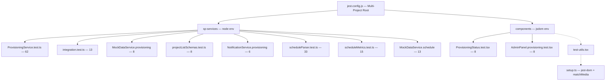

**CLAUDE.md — HBC Project Controls Blueprint (Lean Edition)**

**Performance Rule (Critical)**
This file must stay under 40,000 characters. Never allow it to grow large again. When it approaches the limit, archive older content to CLAUDE_ARCHIVE.md.

**Update Rules (Mandatory)**
Update this file at these specific intervals:
- After every completed data service chunk (SP-8, SP-9, etc.) → update §7 Service Methods Status and §15 Current Phase Status
- After any major architecture or pattern change → update relevant sections (§4, §16)
- After adding new models, enums, or important constants → update §6 Data Models or §13 Constants if critical
- Every 3–4 chunks or when the file exceeds 35k characters → prune non-essential history to CLAUDE_ARCHIVE.md
- Always keep the file focused on: current status, active rules, recent chunks, and live references.

For full historical phase logs (SP-1 through SP-7), complete 221-method table, old navigation, and detailed past pitfalls → see **CLAUDE_ARCHIVE.md**.

**Last Updated:** 2026-02-19 — Sprint 2 completion in progress: TanStack-only routing runtime, router adapter sweep/removal of `react-router-dom`, Wave A optimistic mutations (Leads/Estimating/Buyout/PMP), pessimistic fallback tests, and hard bundle budget enforcement.

**MANDATORY:** After every code change that affects the data layer, update the relevant sections before ending the session.

---

## §0 Development Workflow Rules

- **After any meaningful code change**, run `/verify-changes` and show the full output before concluding the task.
- **Never mark work complete** until verification passes (TypeScript, ESLint, tests).
- **Before commits and PRs**, run `/verify-full-build` to confirm the full production build succeeds.
- **After completing a data service chunk**, run `/review-chunk` to scan real stub counts and generate CLAUDE.md updates.
- **Available commands**: `/verify-changes` (quick), `/verify-full-build` (full), `/status` (overview), `/permissions` (allowlist), `/sp-progress` (stub scan), `/review-chunk` (post-chunk).
- `npm run verify:standalone` → Standalone validation guard (env + browser-node-core + Vite production build)
- `npm run test --workspace=packages/hbc-sp-services -- StandaloneRbacResolver` → Standalone Graph-RBAC resolver safety checks
- `npm run test:e2e -- playwright/mode-switch.spec.ts playwright/offline-mode.spec.ts playwright/standalone-auth.spec.ts` → Standalone shell/mode/offline E2E smoke
- `npm run storybook` → Storybook dev server at http://localhost:6006
- `npm run build-storybook` → Static build to storybook-static/
- `npm run test:e2e` → Playwright E2E (starts dev server automatically)
- `npm run test:e2e:ui` → Playwright interactive UI mode
- `npm run test:a11y` → axe WCAG 2.2 AA accessibility tests (run before marking work complete)
- `npm run verify:sprint2` → Sprint 2 closeout gate (lint + TS + tests + e2e/a11y + standalone report + hard bundle cap checks)
- `npm run verify:sprint3` → Sprint 3 gate (Sprint 2 checks + virtualized/infinite e2e coverage + hard bundle cap checks)

### Command Evolution Guidelines
- **Add** a command when: a workflow repeats 3+ times/week, manual execution is error-prone, or it has clear success/failure criteria.
- **Modify** a command when: user feedback indicates friction, codebase structure changes, or new requirements emerge.
- **Retire** a command when: unused for 3+ months, superseded by a better command, or its phase is complete.

---

## §0a Three-Mode Architecture (Locked — Do Not Change)

| # | Mode | Trigger | Data Service | Auth |
|---|------|---------|-------------|------|
| 1 | **mock** | Default (no .env or DATA_SERVICE_MODE=mock) | MockDataService | None |
| 2 | **standalone** | VITE_DATA_SERVICE_MODE=standalone + login click | StandaloneSharePointDataService | MSAL 5.x browser OAuth |
| 3 | **sharepoint** | SPFx onInit() | SharePointDataService | SPFx implicit |

### Immutable Constraints
- MSAL packages imported ONLY in `dev/auth/` — never in `src/` or `@hbc/sp-services`
- `SharePointDataService` remains auth-agnostic (accepts any SPFI via `.initialize(sp)`)
- `StandaloneSharePointDataService` uses Proxy via `createDelegatingService` — static `.create(spfi, user)` factory
- `AppContext` gains only `dataServiceMode: 'mock' | 'standalone' | 'sharepoint'` — no MSAL types leak in
- Login/logout UI lives exclusively in `dev/RoleSwitcher.tsx` + `dev/auth/MSALAuthProvider.tsx`
- PWA assets in `public/` folder; CopyPlugin copies to webpack output; SW registration in `dev/index.html`
- Mock mode MUST be the absolute default — no .env file needed, no network calls on first load

### New Files (standalone + PWA)
- `dev/auth/msalConfig.ts` — MSAL PublicClientApplication singleton
- `dev/auth/MsalBehavior.ts` — PnP v4 on.auth behavior
- `dev/auth/createStandaloneSpfi.ts` — SPFI factory
- `dev/auth/MSALAuthProvider.tsx` — React bootstrapper
- `packages/hbc-sp-services/src/services/StandaloneSharePointDataService.ts` — Proxy-based wrapper
- `packages/hbc-sp-services/src/services/createDelegatingService.ts` — ES2015 Proxy helper
- `public/manifest.json`, `public/sw.js`, `public/offline.html` — PWA layer

---

## §1 Tech Stack & Build (Current)

- **Framework**: SPFx 1.22.2 + React 18.2.0 + Fluent UI v9 (makeStyles + tokens)
- **Data Layer**: `@hbc/sp-services` monorepo package (shared library)
- **Charting**: Apache ECharts ^5.6.x + echarts-for-react ^3.x (replaced Recharts Feb 2026). Tree-shaking via `echarts/core`. Wrapper: `HbcEChart` (`shared/`). Theme: `hbcEChartsTheme.ts`.
- **Testing (E2E)**: Playwright ^1.50.1 targeting http://localhost:3000 (MockDataService + RoleSwitcher). Specs: `playwright/guards.spec.ts`, `dashboard.spec.ts`, `provisioning.spec.ts`. Role fixture: `playwright/fixtures/roleFixture.ts`.
- **TanStack Foundation (Phase 2 active)**: `@tanstack/react-query@5`, `@tanstack/react-router@1`, `@tanstack/react-table@8`, `@tanstack/react-virtual@3`, `@tanstack/react-form@1` installed and active; runtime routing is TanStack-only with hash history.
- **TanStack Query Wave-1 complete (Hub + Buyout core)**:
  - Query options: `queryOptions/{dataMart,compliance,permissionEngine,buyout}.ts`
  - Hook migrations: `useDataMart`, `useComplianceLog`, `usePermissionEngine`, `useBuyoutLog`, `useCommitmentApproval`, `useContractTracking`
  - SignalR bridge: `tanstack/query/useSignalRQueryInvalidation.ts`
  - New tests: optimistic rollback (`useBuyoutLog`) + SignalR invalidation bridge tests
- **TanStack Router runtime (active)**:
  - Route tree + provider: `tanstack/router/{routes.activeProjects.tsx,router.tsx}`
  - Guard helpers: `tanstack/router/guards/{requirePermission,requireProject,requireFeature}.ts`
  - Legacy `react-router-dom` runtime path removed; adapter hooks are the only navigation abstraction for shared components/tests.
  - Wave-2 route modules: `tanstack/router/{routes.operations.batchA.tsx,routes.operations.batchB.tsx}`
  - Wave-3 route modules: `tanstack/router/{routes.preconstruction.batchA.tsx,routes.preconstruction.batchB.tsx,routes.leadAndJobRequest.batchC.tsx}`
  - Wave-4 route modules: `tanstack/router/routes.adminAccounting.batchD.tsx`
  - Wave-5 route modules: `tanstack/router/routes.system.batchE.tsx`
  - Guard tests: `tanstack/router/__tests__/{guards.test.tsx,operationsGuardChains.test.tsx,preconLeadGuardChains.test.tsx,adminAccountingGuardChains.test.tsx,systemGuardChains.test.tsx}`
  - E2E deep-link parity: `playwright/{operations-router-wave2.spec.ts,precon-lead-router-wave3.spec.ts,admin-accounting-router-wave4.spec.ts,system-router-wave5.spec.ts}`
- **TanStack Table Wave-2 (active)**:
  - Wrapper + hooks: `tanstack/table/{HbcTanStackTable.tsx,useHbcTableState.ts,useVirtualRows.ts,types.ts}`
  - Column adapter: `tanstack/table/columnFactories/toTanStackColumns.ts`
  - Storybook: `components/shared/HbcTanStackTable.stories.tsx`
  - Coverage: All dashboard/admin/preconstruction/project table surfaces now use `HbcTanStackTable`; legacy `DataTable` component and story are removed.
  - Governance: ESLint `no-restricted-imports` blocks new `DataTable` imports outside grandfathered files
  - Threshold virtualization rule: enabled only when row count is `>= 200`
- **Component Library**: Storybook 8.5 (webpack5 builder), stories colocated as `*.stories.tsx`. 9 story files covering KPICard, HbcEChart, RoleGate, FeatureGate, StatusBadge, DataTable, EmptyState, PageHeader, NavigationSidebar.
- **Visual Regression**: Chromatic (cloud) on main pushes; TurboSnap for changed-story-only runs on PRs.
- **Bundle analysis + chunk strategy (Feb 19, 2026)**:
  - Analyzer integration: `webpack-bundle-analyzer@4.10.2` in SPFx gulp (`--analyze`) and standalone webpack (`ANALYZE=true`)
  - New scripts: `serve:analyze`, `bundle:analyze`, `bundle:ship:analyze`, `build:analyze`, `verify:bundle-size`, `dev:analyze`
  - New command: `.claude/commands/verify-bundle-size.md`
  - Stats gate script: `scripts/verify-bundle-size.js` with baseline contract `config/bundle-budget.spfx.json`
  - CI policy: bundle budget warns on PRs and fails on main regressions
  - Phase chunks: `phase-shared`, `phase-preconstruction`, `phase-operations`, `phase-admin-hub`
  - Heavy libs deferred: export stack (`jspdf`, `html2canvas`, `xlsx`) and ECharts runtime
- **Key Commands**:
  - `npm run dev` → Standalone dev server + RoleSwitcher (port 3000)
  - `npm run build:standalone` → Vite standalone production artifact to `dist-standalone/`
  - `npm run preview:standalone` → Serve standalone production artifact locally (port 4173)
  - `npm run storybook` → Storybook dev server (port 6006)
  - `npm run test:e2e` → Playwright E2E (auto-starts dev server)
  - `gulp serve --nobrowser` → SPFx workbench
  - `npm run build` → Full production build (lib → app)
  - `npm run test:ci` → Jest coverage

---

## §4 Core Architecture Patterns (Active)

- **Data Service**: `IDataService` (250 methods) → `MockDataService` (full) + `SharePointDataService` (250/250 — COMPLETE)
- **Data Mart**: Denormalized 43-column hub list aggregating 8+ project-site lists; fire-and-forget sync from hooks; `useDataMart` hook with SignalR refresh
- **Hooks**: Feature-specific hooks call `dataService` methods in `useCallback`
- **TanStack Query pattern (Wave-1)**: hooks expose stable existing APIs while internal reads/mutations use `useQuery`/`useMutation`; query keys scoped by mode/site/project via `qk`.
- **SignalR + Query sync**: migrated hooks use `useSignalRQueryInvalidation` to invalidate query families instead of ad-hoc callback refs.
- **RBAC**: `resolveUserPermissions` → `PermissionGate` / `RoleGate` / `FeatureGate`
- **Styling**: `makeStyles` (structure) + minimal inline (dynamic) + Fluent tokens + `HBC_COLORS`
- **Routing**: TanStack Router (`createHashHistory`) is the sole runtime router; `RouterAdapterProvider` supplies stable `navigate/pathname/search/params` for shared hooks/components.
- **Tables**: `HbcTanStackTable` is the standard migration target for read-heavy grids; retain legacy `DataTable` for non-migrated surfaces until later waves, and block new `DataTable` imports via lint freeze.
- **Charts**: `HbcEChart` wrapper lazily loads ECharts runtime (`echarts-for-react`, `echarts/core`, `hbcEChartsTheme`) into `lib-echarts-runtime` chunk. `EChartsOption` remains `useMemo`; `ResizeObserver` continues handling responsive resize.
- **Audit**: Fire-and-forget `this.logAudit()` with debounce
- **Cross-site Access**: `_getProjectWeb()` helper in SharePointDataService

---

## §7 Service Methods Status (Live)

**Total methods**: 250
**Implemented**: 250
**Remaining stubs**: 0 — DATA LAYER COMPLETE

**Last Completed**:
- GitOps Provisioning (Feb 18): +6 GitOps template methods (getTemplateSiteConfig, updateTemplateSiteConfig, getCommittedTemplateRegistry, getTemplateSiteFiles, applyGitOpsTemplates, logTemplateSyncPR) → 250/250
- Constraints Health Widget (Feb 17): `getAllConstraints()` hub-level cross-project query → 244/244
- Permits Log (Feb 17): 4 new methods → 243/243
- Constraints Log (Feb 17): 4 new methods → 239/239
- Schedule Module (Feb 17): 6 new methods → 235/235
- Provisioning Ops (Feb 16): 8 new methods → 229/229
- Data Mart (Feb 15): 4 methods (`syncToDataMart`, `getDataMartRecords`, `getDataMartRecord`, `triggerDataMartSync`) → 225/225
- SP-13 (Feb 15): Action Inbox — 1 method → 221/221
- SP-12 (Feb 15): Help & Support — 6 methods → 220/221
- SP-11 (Feb 15): Performance Monitoring — 3 methods → 214/221
- SP-10 (Feb 15): Scorecard Workflow — 9 methods → 211/221

**Note**: `sendSupportEmail` is a deliberate no-op (requires Graph API not yet available).

---

## §15 Current Phase Status

**Active Focus (Feb 19): TanStack Query Phase 2 Wave-1 complete + TanStack Router Phase 3 Wave-5 complete + TanStack Table hardening complete (legacy `DataTable` removed).**

- Migrated hooks (contract-preserving):
  - `useDataMart` and `useComplianceLog` now query-driven (filters + summary/records cache)
  - `usePermissionEngine` now query + mutation driven for templates/mappings/assignments
  - `useBuyoutLog`, `useCommitmentApproval`, `useContractTracking` now mutation/invalidation driven
- Added query namespaces in `queryKeys.ts`: `dataMart`, `compliance`, `permission`, `buyout`
- Added query option modules:
  - `queryOptions/dataMart.ts`
  - `queryOptions/compliance.ts`
  - `queryOptions/permissionEngine.ts`
  - `queryOptions/buyout.ts`
- Added `useSignalRQueryInvalidation` bridge for entity-to-query-family invalidation
- Test coverage additions:
  - `components/hooks/__tests__/useBuyoutLog.test.tsx` (optimistic rollback)
  - `tanstack/query/__tests__/useSignalRQueryInvalidation.test.tsx` (SignalR invalidation behavior)
- TanStack Table Wave-2 additions:
  - Page migrations: `PipelinePage`, `EstimatingDashboard`
  - Tests: `tanstack/table/__tests__/HbcTanStackTable.sorting.test.tsx`
  - E2E smoke: `playwright/pipeline-estimating-table-wave2.spec.ts`
  - Parallel a11y lane: improved RoleSwitcher contrast and explicit `aria-label` coverage for migrated select controls

**Phase COMPLETE**: Permits Log Module — 243/243 methods implemented, 550 total tests.

Full P6-style schedule management with multi-format support:
- **Parsing**: CSV, XER (Primavera P6), XML (MSProject + P6 PMXML) via `parseScheduleFile` dispatcher
- **6 tabs**: Overview (9 KPI cards + EV summary), Activities (advanced filters + ExportButtons), Gantt, Critical Path, **Analysis** (8 Recharts chart sections), Import (format dropdown with auto-detect)
- **Enhanced metrics**: `IScheduleMetrics` extended with `negativeFloatPercent`, `cpiApproximation`, `constraintAnalysis`, `earnedValueMetrics` (BAC/EV/PV/SV/SPI/CPI), `logicMetrics` (relationship types, open ends)
- **Shared computation**: `computeScheduleMetrics()` utility used by hook, MockDataService, and SharePointDataService
- **Caching**: sessionStorage with 5-min TTL, SignalR bypass
- **Charts**: Variance scatter, Float distribution bar, Near-critical horizontal bar, Schedule health radar, Logic metrics pie, Constraint analysis bar, Status donut, Earned value combo
- 6 IDataService methods, feature-gated behind `ScheduleModule` flag

**Constraints Log Module** (Feb 17):
- Full CRUD: `getConstraints`, `addConstraint`, `updateConstraint`, `removeConstraint` (4 methods)
- Model: `IConstraintLog` with 10 categories, Open/Closed status, auto-increment constraintNumber
- UI: ConstraintsLogPage with 4 MetricCards, search/status/category filters, ExportButtons, inline editing
- `daysElapsed` calculated at render time (not stored), overdue detection for open + past-due items
- Hook: `useConstraintLog` with SignalR subscription (`EntityType.Constraint`), computed metrics
- Permissions: `CONSTRAINTS_VIEW`, `CONSTRAINTS_EDIT`, `CONSTRAINTS_MANAGE` (Ops=all 3, Exec/Director=VIEW+EDIT)
- 45 project-site schemas, 12 mock entries across 2 project codes

**Permits Log Module** (Feb 17):
- Full CRUD: `getPermits`, `addPermit`, `updatePermit`, `removePermit` (4 methods)
- Model: `IPermit` with 3 types (PRIMARY/SUB/TEMP), 7 statuses, parent-child relationships via `parentRefNumber`
- UI: PermitsLogPage with 5 MetricCards, search/status/type/location filters, ExportButtons, inline editing
- Grouped by Location (Site/Building/Pool), SUB rows indented, Type badges with color coding
- `daysToExpiry` and `expiringSoon` (30-day window) calculated at render time
- Hook: `usePermitsLog` with SignalR subscription (`EntityType.Permit`), computed metrics (total/active/pending/expired/void/expiringSoon/byType/byLocation)
- Permissions: `PERMITS_VIEW`, `PERMITS_EDIT`, `PERMITS_MANAGE` (Ops=all 3, Exec/Director=VIEW+EDIT)
- 45 project-site schemas, 20 mock entries across 2 project codes

**Next Phase**: Integration testing and deployment readiness.
**Router next steps**: maintain parity/soak coverage and keep adapter contract stable while mutation waves continue.

**Performance modernization status (active)**:
- `ExportService` now loads PDF/Excel stack via memoized loaders in `utils/{DynamicImports,LazyExportUtils}.ts`
- `App.tsx` lazy imports are phase-oriented and use explicit chunk names
- TanStack pilot route batches now use `lazyRouteComponent` with phase chunk alignment
- Mock flags added for controlled rollout: `LazyHeavyLibsV1`, `PhaseChunkingV1`

## §15a Provisioning Workflows

**Feature flags**: `AutoSiteProvisioning` (UI gating), `ProvisioningRealOps` (operation dispatch)

**8 IDataService provisioning operation methods** (229 total):
`createProjectSite`, `provisionProjectLists`, `associateWithHubSite`,
`createProjectSecurityGroups`, `copyTemplateFiles`, `copyLeadDataToProjectSite`,
`updateSiteProperties`, `createList`

**Flow**: Lead GO decision → Job# Request → provisionSite() → executeStep() dispatcher
- `useRealOps=true`: Real PnP.js operations (7-step pipeline)
- `useRealOps=false`: simulateStep() 500ms delay (default)

**Steps**: 1.CreateSite → 2.ProvisionLists(batch/5) → 3.HubAssociate → 4.SecurityGroups → 5.CopyTemplates → 6.CopyLeadData → 7.UpdateLead

**Key files**: `ProvisioningService.ts` (orchestrator), `projectListSchemas.ts` (44 list schemas), `ProvisioningService.test.ts` (62 tests), `ProvisioningService.integration.test.ts` (13 tests), `MockDataService.provisioning.test.ts` (8 tests), `projectListSchemas.test.ts` (8 tests)

**Test coverage** (Feb 16): ProvisioningService.ts — 97.27% stmts, 80.76% branches, 94.73% functions, 98.44% lines. projectListSchemas.ts — 100% all metrics. Total: 92 provisioning-specific tests across 4 suites.

## §15b Test Architecture — Provisioning

**Coverage**: ProvisioningService.ts 97%+ stmts/98%+ lines, projectListSchemas.ts 100%, NotificationService.ts ~65% stmts

**Test Suites** (113 provisioning-related + 61 schedule tests):
- Service (node): ProvisioningService.test.ts (62), integration (13), MockDataService.provisioning (8), schemas (8), NotificationService.provisioning (6)
- Component (jsdom): ProvisioningStatus.test.tsx (8), AdminPanel.provisioning.test.tsx (8)

**Jest config**: Root multi-project — `sp-services` (node) + `components` (jsdom)

**Test utils**: `src/__tests__/test-utils.tsx` — `renderWithProviders` with FluentProvider + MemoryRouter + AppProvider

**Run commands**:
- `npx jest` — all 575 tests across both projects
- `npx jest --selectProjects components` — UI tests only (16)
- `npx jest --selectProjects sp-services` — service tests only (575)

## §15c GitOps Template Provisioning (Feb 18)

**Feature flags**: `GitOpsProvisioning` (id:33, step 5 routing), `TemplateSiteSync` (id:34, Admin Panel UI)

**6 IDataService GitOps methods** (250 total):
`getTemplateSiteConfig`, `updateTemplateSiteConfig`, `getCommittedTemplateRegistry`,
`getTemplateSiteFiles`, `applyGitOpsTemplates`, `logTemplateSyncPR`

**Architecture**:
- `TemplateSyncService.computeDiff()` — SHA-256 hash diff between live Template Site and committed registry
- `GitOpsProvisioningService.applyTemplates()` — step 5 orchestrator with `TemplateAppliedFromGitOps` audit
- `ProvisioningService` step 5: delegates to `GitOpsProvisioningService` when `GitOpsProvisioning=true`
- `TemplateSiteSyncPanel` — Admin Panel sub-panel with [Check for Changes] + [Create GitHub PR] flow
- Azure Function `createTemplatePR` — creates GitHub branch + commits registry + opens PR
- CI: `.github/workflows/gitops-validate.yml` validates `/templates/**` on PRs

**New files**:
- `templates/template-registry.json` — committed source of truth (12 entries)
- `templates/{All,Commercial,LuxuryResidential}/pnp-template.json` — PnP provisioning templates
- `infrastructure/gitops.bicep` — GitOps Function App with Key Vault ref for `GITHUB_APP_TOKEN`
- `functions/src/functions/createTemplatePR.ts` — Azure Function v4
- `packages/hbc-sp-services/src/services/GitOpsProvisioningService.ts`
- `packages/hbc-sp-services/src/services/TemplateSyncService.ts`
- `src/webparts/.../components/shared/TemplateSiteSyncPanel.tsx`

**Test coverage**: 22 new tests (F1-F4) + 3 E2E tests → 575 total Jest tests (602 incl. E2E)

---

## §16 Active Pitfalls & Rules

(Only the most relevant current ones are kept here. Full historical list is in CLAUDE_ARCHIVE.md)

- Always use `columnMappings.ts` — never hard-code column names.
- Call `this.logAudit()` on every mutation.
- Use `_getProjectWeb()` for project-site lists.
- Hub-site reference data (e.g. Division_Approvers, PMP_Boilerplate) uses `this.sp.web`.
- After mutations that affect assemblies, always re-read + re-assemble (e.g. PMP, Monthly Review, Turnover Agenda).
- `Turnover_Estimate_Overviews` is a new SP list — must be provisioned before feature goes live.
- `Project_Data_Mart` is a new hub-site SP list (43 columns) — must be provisioned before Data Mart feature goes live.
- Data Mart sync is fire-and-forget — never await in hooks; use `.catch(() => { /* silent */ })`.
- XML parser tests require JSDOM's `DOMParser` (not `@xmldom/xmldom` — it lacks `querySelector`). Assign globally: `(global as unknown as Record<string, unknown>).DOMParser = new JSDOM('').window.DOMParser;`
- Schedule metrics tests use `jest.useFakeTimers()` + `jest.setSystemTime()` for deterministic PV/SV calculations.
- **ECharts**: NEVER import `* as echarts from 'echarts'` (disables tree-shaking). Use `echarts/core` + `echarts.use([...])`.
- **SPFx/browser runtime**: Never import Node core modules (`crypto`, `fs`, `path`, etc.) in `src/` or `packages/hbc-sp-services/src/` service code. Use browser APIs (e.g., `globalThis.crypto.subtle`) to avoid webpack ship-bundle failures.
- **Standalone env gate**: `VITE_DATA_SERVICE_MODE` must be `mock|standalone`; when `standalone`, require valid `VITE_AAD_CLIENT_ID`, `VITE_AAD_TENANT_ID`, and HTTPS `VITE_SP_HUB_URL` (`npm run validate:standalone-env`).
- **Standalone context detection**: `createStandaloneRuntimeContext()` resolves live site URL from SharePoint, then `detectSiteContext()` determines hub/project context. `VITE_SP_SITE_URL` is optional override only.
- **Standalone cross-tenant guard**: standalone runtime blocks if detected site origin differs from configured hub origin (prevents accidental cross-tenant queries).
- **Standalone Graph RBAC fallback**: Graph `/me/transitiveMemberOf` failures must fail-soft to email-based role matching from `App_Roles.UserOrGroup`; never hard-fail app init solely due to missing `Group.Read.All` consent.
- **SWA deploy safety**: Keep `public/staticwebapp.config.json` with SPA fallback exclusions for `/sw.js`, `/manifest.json`, `/offline.html`, `/icons/*`, `/assets/*` to preserve PWA behavior.
- **TanStack Router rule**: do not introduce new direct router-library imports in app code; use adapter hooks (`useAppNavigate`, `useAppLocation`, `useAppParams`) for shared components and tests.
- **TanStack Table rule**: use threshold virtualization only (`>= 200` rows). For smaller datasets prefer standard rendering for accessibility and behavior parity.
- **TanStack Table governance rule**: no new imports from `shared/DataTable` outside grandfathered files; use `HbcTanStackTable` for all new table migrations.
- **ECharts**: NEVER build `EChartsOption` inline in JSX — always `useMemo`. Radar `indicator` array ≠ Recharts data array shape.
- **ECharts Jest**: `echarts-for-react` + `echarts/*` mocked in `src/__mocks__/`. Assert on `data-chart-type` attr. `ResizeObserver` stubbed on `window` in `src/__tests__/setup.ts`.
- **ECharts label formatter**: type parameter as `unknown`, cast to `{ name: string; value: number; percent: number }` — never use typed params directly (ECharts uses `CallbackDataParams`).
- Keep `CLAUDE.md` lean — archive old content aggressively.
- **A11y rule**: All new components require a Storybook story that passes axe WCAG 2.2 AA zero-violations check. Run `npm run test:a11y` before marking work complete.
- **A11y rule**: Never use `gray400`, `gray500`, `orange`, or `lightOrange` as foreground text on white — use `textGray` (#4B5563) or `textOrangeLarge` (#C45E0A) for text instead.
- **A11y rule**: All `<table>` elements require `ariaLabel` prop; sortable `<th>` require `aria-sort` + `tabIndex={0}` + keyboard handler; clickable `<tr>` require `tabIndex={0}` and `onKeyDown` handler.
- **A11y rule**: ECharts `ariaDescription` prop uses `aria-describedby` + visually-hidden `
` — never `aria-description` (non-standard attribute, ignored by screen readers).
- **A11y rule**: Form `<label>` elements must use `htmlFor` paired with `id` on the input; required fields must have `aria-required={true}`; fields with errors must have `aria-invalid={true}` + `aria-describedby` pointing to error span `id`.
- **SPFx 1.22.2**: Uses `@microsoft/rush-stack-compiler-5.3` (TypeScript 5.3.3). `npx tsc --noEmit` uses TS 5.3.3. The SPFx gulp internal tsc subtask still reports 4.7.4 (from `gulp-core-build-typescript` internals) — this is expected, not an error.
- **Future-proofing artifacts**: `.yo-rc.json` (Yeoman generator config for `yo @microsoft/sharepoint --upgrade`), `config/heft.json` (inert scaffold for 1.23+ Heft-native builds), `scripts/upgrade-spfx.sh` (version-bump helper). @microsoft/signalr peer dep range updated to `^8.0.0 || ^10.0.0` in hbc-sp-services.
- **Storybook ECharts**: Real ECharts in Storybook (browser canvas), no mock. Always pass explicit numeric `height` prop to HbcEChart in stories (0×0 canvas collapses otherwise).
- **Storybook providers**: Global decorator in preview.ts omits SignalRProvider (WebSocket noise). Stack order: FluentProvider → MemoryRouter → AppProvider → HelpProvider → ToastProvider.
- **Storybook dataService**: `new MockDataService()` singleton at preview.ts level. `createComponentMockDataService()` from test-utils.tsx is Jest-only (uses jest.fn()) — DO NOT import in stories.
- **Storybook RoleName**: Use `RoleName.BDRepresentative` (not `BDRep`) — enum value is `'BD Representative'`.
- **Playwright role switching**: Use `[data-testid="role-switcher"] select` locator. Labels from `dev/RoleSwitcher.tsx` ROLE_OPTIONS: `'President / VP Operations'` for ExecutiveLeadership, `'BD Representative'` for BDRepresentative, `'Project Executive'` for OperationsTeam.
- **Playwright webServer**: `reuseExistingServer: !process.env.CI` — reuses existing `npm run dev` session locally; spawns fresh in CI.
- **Playwright fullyParallel**: Set to `false` initially (single dev server). Switch to `true` after specs stable for ~50% CI time reduction.
- **Chromatic usage**: Free tier = 5,000 snapshots/month. TurboSnap enabled by default with `@chromatic-com/storybook@3+`. Upgrade to Starter ($20/month) if PR volume >10/week or story count >30.
- **WCAG 2.2 AA a11y config**: `runOnly.values` in preview.ts includes `wcag22aa` explicitly. Covers 2.5.8 Target Size + 2.4.11 Focus Visible. Fluent UI v9 native components pass without override.
- **Storybook tsconfig**: Uses `.storybook/tsconfig.storybook.json` (extends root). `rootDir: ".."` is required — otherwise TypeScript won't find `@hbc/sp-services` source.
- **GitOps step 5**: `ProvisioningService` case 5 delegates to `new GitOpsProvisioningService(this.dataService).applyTemplates(siteUrl, input.division)` — NOT inline `dataService` calls. The `GitOpsProvisioningService` provides the `TemplateAppliedFromGitOps` audit fire-and-forget.
- **GitOps constructor arg**: `ProvisioningService` 7th arg is `useGitOpsProvisioning`. All 3 instantiation sites (AdminPanel, AccountingQueuePage, JobNumberRequestForm) pass `isFeatureEnabled('GitOpsProvisioning')`.
- **GitHub raw content URL**: `https://raw.githubusercontent.com/{owner}/{repo}/{branch}/{path}` — used in `SharePointDataService.getCommittedTemplateRegistry()`.
- **fileHash convention**: always `sha256:` prefix + hex (e.g. `sha256:a3b4c5...`) — set in `getTemplateSiteFiles()` and validated by `scripts/validate-template-registry.js`.
- **Template Site files**: `getBuffer()` returns `ArrayBuffer` — wrap in `Buffer.from()` before `createHash()`.
- **TemplateSiteSync flag**: Disabled by default (Enabled:false in featureFlags.json). Feature gates both Admin Panel UI and the `Check for Changes` flow.
- **MSAL v5 init**: `MsalProvider` from `@azure/msal-react@5.x` calls `instance.initialize()` internally — never call it manually before `<MsalProvider>` renders (double-init error).
- **PnP v4 behavior order**: `DefaultHeaders()` → `DefaultInit()` → `BrowserFetch()` → auth behavior (auth MUST be last — prior behaviors set headers auth reads).
- **SP scope format**: `https://{tenant}.sharepoint.com/.default` (with `.default`) — NOT `Sites.ReadWrite.All` format.
- **SW on localhost**: SW registration skipped on localhost (`window.location.hostname !== 'localhost'`) to avoid dev cache issues.
- **StandaloneSharePointDataService Proxy**: Uses `createDelegatingService` (ES2015 Proxy). New IDataService methods forwarded automatically — NO manual delegation needed.
- **createDelegatingService TypeScript**: Proxy `get` trap uses `string | symbol` prop key. Cast targets as `unknown as Record<string | symbol, unknown>` to avoid "implicit any" under `strict: true`.
- **IBinaryAttachment markupJson**: Store as string (not object) to survive JSON round-trips through SP column storage.
- **RoleSwitcher standalone mode**: `onRoleChange` is a no-op in standalone (real user from MSAL). "Login (Real Data)" button only shown when `process.env.AAD_CLIENT_ID` is set.
- **TanStack query-key scoping**: Always include mode + siteContext + siteUrl + projectCode in query keys to prevent cache leakage across mock/standalone/sharepoint and hub/project contexts.
- **TanStack migration rule**: Wrap `IDataService` with Query/Mutation; never bypass directly to PnP in UI-layer TanStack query functions.
- **TanStack optimistic mutation rule**: For editable grids/logs, `onMutate` must snapshot previous cache and `onError` must restore it (rollback is mandatory, not optional).
- **Sprint 3 infinite-query rule**: `useInfiniteSharePointList` must keep explicit fallback to full-list `useQuery` when `InfinitePagingEnabled` is OFF.
- **Sprint 3 SignalR rule**: infinite list surfaces invalidate the base infinite query key on entity change; do not invalidate per-page keys.
- **Optimistic mutation flag contract**: global `OptimisticMutationsEnabled` must be true before any domain flag is honored. Wave A domain flags: `OptimisticMutations_Leads`, `OptimisticMutations_Estimating`, `OptimisticMutations_Buyout`, `OptimisticMutations_PMP`.
- **Pessimistic fallback contract**: when global/domain flags are off or method is unmapped, mutation must run without optimistic cache writes and still run success/settled invalidation effects.
- **Sprint 2 verification rule**: run `npm run verify:sprint2` before merge (lint, strict type-check, tests/a11y/e2e smoke, standalone analyze report, hard bundle-size gate).
- **SignalR invalidation rule**: Migrate new Query-based hooks to `useSignalRQueryInvalidation`; avoid reintroducing callback-ref refresh patterns.

---

**For complete history, full method tables, old navigation, and detailed past phases → see CLAUDE_ARCHIVE.md**
