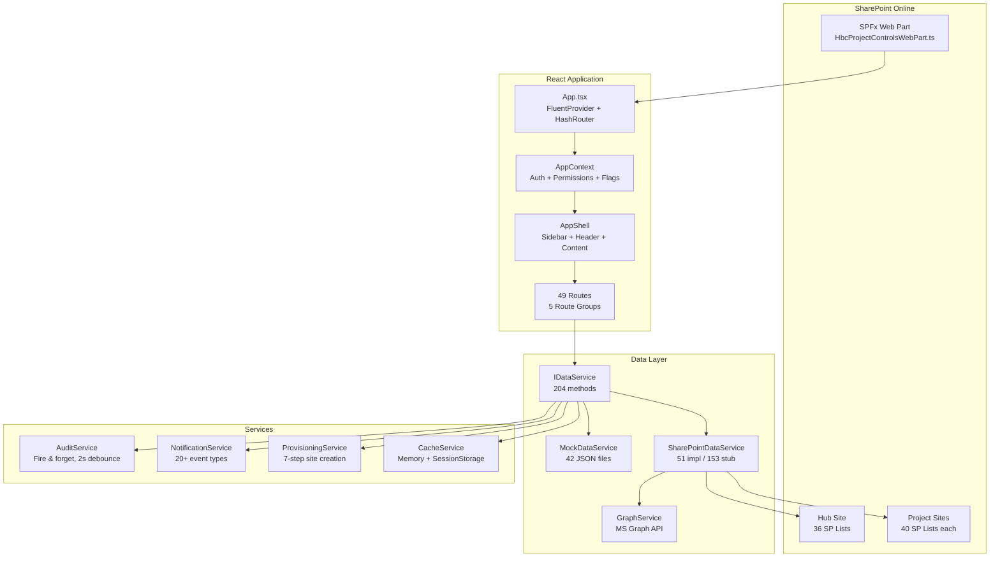

# HBC Project Controls

**Unified project lifecycle management for Hedrick Brothers Construction**


-339933)


---

## Overview

HBC Project Controls is a SharePoint Framework (SPFx) web part that manages the full project lifecycle for a commercial general contractor — from lead intake and Go/No-Go evaluation through preconstruction, operations, and project closeout.

The application runs inside SharePoint Online as a single-page app with hash-based routing. It detects whether it's deployed on a **hub site** (company-wide views) or a **project-specific site** (scoped to one project) and adjusts navigation and data access accordingly.

**Who it's for:** Business Development, Estimating, Project Management, Accounting, Marketing, Executive Leadership, and IT Administration teams at Hedrick Brothers Construction.

**What makes it different:**

- **Context-aware** — automatically detects hub vs. project site and adjusts UI
- **Role-based access** — 14 roles with 70+ granular permissions, plus a template-based permission engine for project-level scoping
- **Feature-flagged** — 23 flags across 5 categories control what's visible per role and environment
- **AI-assisted development** — built with Claude + Cursor using a living blueprint (`CLAUDE.md`) that documents every model, route, permission, and service method

---

## Key Features

| Category | Features |
|----------|----------|
| **Marketing** | Marketing Dashboard, Project Records (9-section form), completion tracking, Excel export |
| **Preconstruction** | Lead intake, Pipeline dashboard, Go/No-Go scorecards (10-status workflow), Estimating tracker (inline-editable), Estimating kickoffs, Post-bid autopsies, Pursuit detail with deliverables/interview/win-loss/turnover/loss autopsy tools |
| **Operations** | Active Projects portfolio, Project Startup checklist (55 items), Responsibility matrices (Internal/Owner/Sub), Project Management Plan (16 sections, approval cycles, signatures), Superintendent's Plan, Risk & Cost management, Quality/Safety trackers, Schedule & Critical Path, Monthly Project Review (10-step workflow), Buyout log with commitment approval, Compliance log, Contract tracking, Closeout checklist, Lessons Learned |
| **Turnover** | Formal meeting agenda (prerequisites, estimate overview, 10 discussion items, subcontractor table, 10 exhibits, 4-party signature block with affidavit) |
| **Admin** | 9-tab Admin Panel (Connections, Roles, Feature Flags, Provisioning, Workflows, Audit Log, Permissions, Sectors, Assignments), configurable approval-chain workflows, assignment mappings, site provisioning (7-step engine with PowerAutomate fallback) |
| **Security** | RBAC with 14 roles, permission engine with templates + project scoping, Azure AD people picker, Graph API integration (8 scopes), audit trail |

---

## Architecture



### Data Flow

1. **SPFx Web Part** mounts the React app with a `dataService` instance (Mock or SharePoint based on `dataServiceMode` property)
2. **AppContext** initializes current user, roles, permissions, feature flags, and site context
3. **Hooks** (`use*.ts`) call `dataService` methods via `useCallback` — never in render
4. **MockDataService** loads from JSON files and maintains in-memory state for mutations
5. **SharePointDataService** reads/writes to SharePoint lists via PnP/sp, with column mappings in `columnMappings.ts`

### Security Model

```
Azure AD Groups --> RoleName (14 roles) --> ROLE_PERMISSIONS --> Set<string>
                                                |
                                    [Permission Engine enabled?]
                                                |
                              Security Group Mapping --> Permission Template
                                                            |
                                                   Project Team Assignment
                                                            |
                                                   Granular Flag Overrides
                                                            |
                                                   resolveToolPermissions()
                                                            |
                                                    Resolved Set<string>
```

### Routing

Hash-based routing (`HashRouter`) with 49 routes across 5 groups:

| Group | Prefix | Example Routes |
|-------|--------|----------------|
| Dashboard | `/` | `/` |
| Marketing | `/marketing` | `/marketing` |
| Preconstruction | `/preconstruction/*`, `/lead/*` | `/preconstruction/pipeline`, `/lead/new`, `/lead/:id/gonogo` |
| Operations | `/operations/*` | `/operations/project`, `/operations/buyout-log`, `/operations/monthly-review` |
| Admin | `/admin`, `/job-request`, `/accounting-queue` | `/admin`, `/job-request/:leadId` |

---

## Tech Stack

| Layer | Technology | Version |
|-------|-----------|---------|
| Framework | SharePoint Framework (SPFx) | 1.21.1 |
| UI Library | React | 17.0.1 |
| Language | TypeScript | ~5.3.3 |
| Components | Fluent UI v9 (`@fluentui/react-components`) | ^9.46.0 |
| Icons | `@fluentui/react-icons` | ^2.0.230 |
| Routing | react-router-dom | ^6.22.3 |
| SharePoint Data | @pnp/sp, @pnp/graph | ^4.4.1 |
| Charts | Recharts | ^2.12.3 |
| PDF Export | jsPDF + html2canvas | ^2.5.2 / ^1.4.1 |
| Excel Export | SheetJS (xlsx) | ^0.18.5 |
| Build | gulp + webpack | ^4.0.2 / ^5.90.0 |
| Tests | Jest + React Testing Library | ^29.7.0 / ^12.1.5 |
| Linting | ESLint + SPFx config | ^8.57.0 |
| Node (Volta) | Node.js | 22.14.0 |

---

## Getting Started

### Prerequisites

- **Node.js** 22.14.0 (managed via [Volta](https://volta.sh/))
- **npm** (included with Node)
- **Gulp CLI** — `npm install -g gulp-cli`
- A SharePoint Online tenant (for deployment)

### Install

```bash
git clone <repo-url>
cd Project-Controls
npm install
```

### Local Development (Mock Data)

```bash
npm run dev
```

Opens a standalone dev server on `http://localhost:3000` with mock data. Includes a **RoleSwitcher** to test all 14 roles + a dev super-admin mode.

### SPFx Workbench

```bash
volta run --node 22.14.0 gulp serve --nobrowser
```

Opens the SPFx local workbench at `https://localhost:4321`. Navigate to your SharePoint workbench page to test in-context.

### Production Build

```bash
npm run build
```

Runs `gulp bundle --ship && gulp package-solution --ship`. Outputs `sharepoint/solution/hbc-project-controls.sppkg`.

### Deploy to SharePoint

1. Build the `.sppkg` package (see above)
2. Upload to your tenant App Catalog (`/sites/AppCatalog`)
3. Deploy to all sites (skip feature deployment is enabled)
4. Grant Graph API permissions in SharePoint Admin Center (8 scopes — see [Security & Permissions](#security--permissions))
5. Add the web part to a page
6. Set the `dataServiceMode` web part property to `'sharepoint'` for live data

### Available Scripts

| Command | Description |
|---------|-------------|
| `npm run dev` | Standalone dev server (port 3000, mock data) |
| `npm run build` | Production bundle + package |
| `npm run test` | Run Jest tests |
| `npm run lint` | ESLint check |
| `npm run lint:fix` | ESLint auto-fix |
| `gulp serve --nobrowser` | SPFx workbench (prefix with `volta run --node 22.14.0`) |
| `gulp bundle --ship` | Production bundle only |
| `gulp package-solution --ship` | Package .sppkg only |

---

## Project Structure

```
src/webparts/hbcProjectControls/
├── HbcProjectControlsWebPart.ts        # SPFx entry point
├── components/
│   ├── App.tsx                          # Root: FluentProvider → HashRouter → AppShell → Routes
│   ├── contexts/AppContext.tsx          # Global state: user, permissions, flags, project
│   ├── guards/                          # RoleGate, FeatureGate, PermissionGate, ProtectedRoute, ProjectRequiredRoute
│   ├── hooks/                           # 39 custom hooks (useLeads, useGoNoGo, useWorkflow, etc.)
│   ├── layouts/                         # AppShell, NavigationSidebar
│   ├── pages/
│   │   ├── hub/                         # Dashboard, Pipeline, Admin, Leads, Go/No-Go (17 pages)
│   │   ├── precon/                      # Estimating, Pursuits, Autopsies (7 pages)
│   │   ├── project/                     # Operations, PMP, Controls, Matrices (26 pages + pmp/)
│   │   └── shared/                      # AccessDeniedPage
│   └── shared/                          # 33 reusable components (DataTable, KPICard, ExportButtons, etc.)
├── mock/                                # 42 JSON mock data files
├── models/                              # 45 TypeScript model files (enums.ts + I*.ts interfaces)
├── services/
│   ├── IDataService.ts                  # 204-method interface
│   ├── MockDataService.ts              # Full mock implementation
│   ├── SharePointDataService.ts        # SP implementation (51 impl, 153 stubs)
│   ├── GraphService.ts                 # MS Graph: users, photos, calendar, mail, Teams
│   ├── AuditService.ts                 # Fire-and-forget audit queue
│   ├── CacheService.ts                 # Two-tier cache (memory + sessionStorage)
│   ├── NotificationService.ts          # 20+ event-driven notification handlers
│   ├── ProvisioningService.ts          # 7-step site provisioning engine
│   ├── ExportService.ts               # Branded PDF/Excel/CSV export
│   ├── columnMappings.ts              # SP column name mappings (1,267 lines)
│   └── ...                             # OfflineQueue, PowerAutomate, HubNavigation
├── theme/                               # HBC brand colors, Fluent UI v9 theme, global styles
└── utils/                               # Permissions, validators, formatters, stage engine, constants

dev/                                      # Standalone dev server + RoleSwitcher + mock context
config/                                   # SPFx config (package-solution, serve, config)
docs/                                     # DATA_ARCHITECTURE.md, PERMISSION_STRATEGY.md, SECURITY_ANALYSIS.md
```

---

## Data & SharePoint Lists

The application reads from and writes to SharePoint lists organized across two site types:

### Hub Site Lists (36)

Centralized data shared across all projects:

| Category | Lists |
|----------|-------|
| Core | Leads_Master, App_Roles, Feature_Flags, Audit_Log, Audit_Log_Archive |
| Preconstruction | GoNoGo_Scorecard, GNG_Committee, Estimating_Tracker, Estimating_Kickoffs, Estimating_Kickoff_Items, Loss_Autopsies |
| Workflow | Workflow_Definitions, Workflow_Steps, Workflow_Conditional_Assignments, Workflow_Step_Overrides |
| Scorecard | Scorecard_Approval_Cycles, Scorecard_Approval_Steps, Scorecard_Versions |
| Permissions | Permission_Templates, Security_Group_Mappings, Project_Team_Assignments |
| Reference | Active_Projects_Portfolio, Job_Number_Requests, Project_Types, Standard_Cost_Codes, Sector_Definitions, Assignment_Mappings, Template_Registry, Marketing_Project_Records, Lessons_Learned_Hub |
| Infrastructure | Provisioning_Log, App_Context_Config, Regions, Sectors, Autopsy_Attendees |

### Per-Project Site Lists (40)

Created during site provisioning for each project:

| Category | Lists |
|----------|-------|
| Team & Deliverables | Team_Members, Deliverables, Action_Items |
| Startup | Startup_Checklist, Checklist_Activity_Log |
| Matrices | Internal_Matrix, Owner_Contract_Matrix, Sub_Contract_Matrix |
| PMP | Project_Management_Plans, PMP_Signatures, PMP_Approval_Cycles, PMP_Approval_Steps |
| Controls | Risk_Cost_Management, Risk_Cost_Items, Quality_Concerns, Safety_Concerns, Project_Schedule, Critical_Path_Items |
| Operations | Superintendent_Plan, Superintendent_Plan_Sections, Lessons_Learned, Buyout_Log, Commitment_Approvals |
| Reviews | Monthly_Reviews, Monthly_Checklist_Items, Monthly_Follow_Ups |
| Turnover | Turnover_Agendas, Turnover_Prerequisites, Turnover_Discussion_Items, Turnover_Subcontractors, Turnover_Exhibits, Turnover_Signatures, Turnover_Attachments, Turnover_Checklist |
| Closeout | Closeout_Items, Marketing_Project_Record, Contract_Info, Interview_Prep, Project_Info |

---

## Security & Permissions

### RBAC Roles (14)

| Role | Description | Admin Access |
|------|-------------|--------------|
| BD Representative | Lead intake, Go/No-Go originator, marketing | No |
| Estimating Coordinator | Estimating tracker, kickoffs, pursuits | No |
| Accounting Manager | Job number finalization, accounting queue | No |
| Preconstruction Team | Precon editing, proposals | No |
| Operations Team | All project operations, PMP, buyout | No |
| Executive Leadership | Full access including admin | Yes |
| Department Director | Operational leadership, no admin | No |
| Legal | Contract editing | No |
| Risk Management | Risk editing, compliance | No |
| Marketing | Marketing records, project records | No |
| Quality Control | Quality concern editing | No |
| Safety | Safety concern editing | No |
| IDS (OpEx Manager) | Operations, permission management | Partial |
| SharePoint Admin | Full access (all permissions) | Yes |

### Graph API Scopes (8)

| Scope | Purpose |
|-------|---------|
| User.Read | Current user profile |
| Group.Read.All | Security group membership |
| Group.ReadWrite.All | Add members to project site groups |
| Calendars.Read.Shared | Meeting availability checks |
| Calendars.ReadWrite | Schedule meetings |
| Mail.Send | Email notifications |
| Chat.Create | Teams chat creation |
| ChatMessage.Send | Teams chat messages |

### Guard Components

| Guard | Purpose |
|-------|---------|
| `RoleGate` | Renders children only if user has one of the allowed roles |
| `PermissionGate` | Renders children only if user has a specific permission |
| `FeatureGate` | Renders children only if a feature flag is enabled |
| `ProtectedRoute` | Redirects to `/access-denied` if permission is missing |
| `ProjectRequiredRoute` | Shows "No Project Selected" if no project is selected |

### Feature Flags (23)

Organized into 5 categories: **Core Platform** (6), **Preconstruction** (3), **Project Execution** (4), **Infrastructure** (5), **Integrations** (5).

Feature flags control visibility at both the **navigation level** (sidebar items) and the **route level** (page access). Flags can be restricted to specific roles.

---

## Development Workflow

### Adding a New Page

Follow the standard sequence defined in `CLAUDE.md §14`:

1. **Model** — `models/INewEntity.ts` + barrel export
2. **Mock data** — `mock/newEntities.json`
3. **Service methods** — add to `IDataService.ts`, implement in `MockDataService.ts`, stub in `SharePointDataService.ts`
4. **Column mappings** — add to `columnMappings.ts` if new SP list
5. **Hook** — `hooks/useNewEntity.ts` + barrel export
6. **Component** — page in `pages/{hub|precon|project}/`
7. **Route** — add to `App.tsx`
8. **Navigation** — add to `NavigationSidebar.tsx`
9. **Permissions** — add to `utils/permissions.ts` if needed
10. **Update CLAUDE.md** — update all affected sections (mandatory)

### CLAUDE.md — The Living Blueprint

`CLAUDE.md` is the single source of truth for this project. It documents every interface, service method, route, permission, feature flag, and constant. **You must update it after every code change.** See the 16 sections (§1–§16) for what to update.

### Mock Data

All mock data lives in `mock/*.json`. `MockDataService` loads these files and maintains in-memory state for mutations. When adding mock data:

- Deep-clone on read (prevent reference mutation)
- Follow existing naming conventions (camelCase filenames, entity-plural)
- Include realistic sample data that covers edge cases

### Styling

All styling uses inline `style={{}}` with `HBC_COLORS` from `theme/tokens.ts`. No CSS modules, SCSS, or CSS-in-JS libraries. This is intentional for SPFx compatibility and consistency.

---

## Screenshots

> Screenshots will be added after UI stabilization.

| Screen | Description |
|--------|-------------|
| Dashboard | KPI cards, Action Inbox, Pipeline chart, Project Setup Tracker |
| Pipeline | Lead pipeline visualization with stage breakdown |
| Go/No-Go Scorecard | 10-status workflow with Director/Committee review |
| Estimating Dashboard | 3-tab inline-editable tracker |
| Project Management Plan | 16-section consolidated view with approval cycles |
| Admin Panel | 9-tab configuration center |
| Turnover Meeting | Formal agenda with prerequisites, exhibits, signatures |
| Active Projects | Portfolio dashboard with financials and risk metrics |

---

## Roadmap

### Completed (32 Phases)

| Phase | Milestone |
|-------|-----------|
| 1–3 | Foundation — Lead intake, Go/No-Go, RBAC, feature flags |
| 4–5 | Infrastructure — Meetings, notifications, site provisioning |
| 6–8 | Preconstruction — Pursuits, estimating, job numbers, executive dashboard |
| 9–10 | Project Execution — Startup, matrices, PMP, operational modules, monthly review |
| 11–12 | Architecture — Data strategy refactor, unified navigation |
| 13–16 | Workflows — Admin workflows, turnover agenda, hub nav, scorecard refinement |
| 17–18 | Roles — Director role, action inbox, Go/No-Go bug fixes |
| 19A–D | Permission Engine — Templates, project scoping, environment tiers, dynamic sectors |
| 20–24 | UX — SharePoint Admin role, nav cleanup, BD Rep / EC enhancements |
| 25–29 | Polish — Job number form, site detection, admin assignments, autopsies, provisioning |
| 30–32 | Deployment — Readiness assessment, Tier 0 remediation, security audit |

### Upcoming

| Priority | Item |
|----------|------|
| **P1** | SharePointDataService stub implementation (153 remaining methods) |
| **P2** | ERP integrations (Unanet, Sage 300) |
| **P3** | AI contract review (Document Crunch) |
| **P4** | Offline support with queue sync |
| **P5** | Dual notifications (Email + Teams) |

---

## Contributing

### Before You Code

1. Read `CLAUDE.md` — it's the project blueprint
2. Check the relevant sections for existing patterns
3. Follow the [standard sequence](#adding-a-new-page) for new features

### After You Code

1. **Update `CLAUDE.md`** — this is mandatory, not optional
2. Update all affected sections (models, routes, permissions, service methods, etc.)
3. Verify the dev server still runs: `npm run dev`

### Branch Naming

```
feature/phase-XX-short-description
fix/description-of-fix
```

### Commit Messages

Use conventional format:

```
Implement <feature description> (Phase XX)
Fix <bug description>
```

---

## License & Credits

**License:** MIT

**Built with:**

- [Claude](https://claude.ai) (Anthropic) — AI-assisted development
- [Cursor](https://cursor.com) — AI-powered IDE
- [Claude Code](https://claude.com/claude-code) — CLI for Claude

**Developer:** Hedrick Brothers Construction

**Solution ID:** `a3e7b5d2-9f14-4c68-b3a1-2d5e8f6c9b04`
