# HBC Project Controls -- Data Architecture

> **Version**: 1.0.0
> **Last Updated**: 2026-02-08
> **Platform**: SharePoint Online (SPFx 1.21.1)
> **Tenant**: hedrickbrothers.sharepoint.com

---

## Table of Contents

1. [Entity Catalog](#1-entity-catalog)
2. [Entity Relationship Diagram](#2-entity-relationship-diagram)
3. [Hub-Level Lists](#3-hub-level-lists)
4. [Project-Level Lists](#4-project-level-lists)
5. [Document Libraries](#5-document-libraries)
6. [Cross-Site Data Flow](#6-cross-site-data-flow)
7. [Data Lifecycle](#7-data-lifecycle)
8. [SharePoint Column Type Mapping](#8-sharepoint-column-type-mapping)
9. [Index Strategy](#9-index-strategy)
10. [Integration Touchpoints](#10-integration-touchpoints)

---

## 1. Entity Catalog

The system comprises 37 entities distributed across a central Hub site and per-project sites. The Hub site (`/sites/HBCHub`) stores enterprise-wide records; each Project site (`/sites/{ProjectCode}`) stores project-scoped operational data.

| # | Interface Name | SP List Name | Site | PK | FKs | Est. 3-Year Volume | Indexed Columns | R/W Frequency |
|---|---------------|-------------|------|----|----|-------------------|----------------|--------------|
| 1 | `ILead` | `Leads_Master` | Hub | `id` | -- | 1,500--2,500 | `Stage`, `Region`, `ProjectCode` | High / High |
| 2 | `IGoNoGoScorecard` | `GoNoGo_Scorecard` | Hub | `id` | `LeadID` -> Leads_Master | 800--1,200 | `LeadID`, `ProjectCode` | Medium / Medium |
| 3 | `IEstimatingTracker` | `Estimating_Tracker` | Hub | `id` | `LeadID` -> Leads_Master | 800--1,200 | `LeadID`, `ProjectCode`, `AwardStatus` | High / Medium |
| 4 | `IRole` | `App_Roles` | Hub | `id` | -- | 12--15 | -- | Low / Low |
| 5 | `IFeatureFlag` | `Feature_Flags` | Hub | `id` | -- | 20--30 | -- | Low / Low |
| 6 | `IAuditEntry` | `Audit_Log` | Hub | `id` | -- | 50,000--100,000 | `EntityType`, `EntityId`, `Timestamp`, `ProjectCode` | Low / High |
| 7 | `IAuditEntry` (archive) | `Audit_Log_Archive` | Hub | `id` | -- | 100,000+ | `EntityType`, `Timestamp` | Low / Low |
| 8 | `IProvisioningLog` | `Provisioning_Log` | Hub | `id` | `leadId` -> Leads_Master | 200--400 | `projectCode`, `status` | Low / Medium |
| 9 | `IActiveProject` | `Active_Projects_Portfolio` | Hub | `id` | `projectCode` -> Leads_Master | 100--200 | `projectCode`, `status`, `sector` | Medium / Medium |
| 10 | -- | `Template_Registry` | Hub | `id` | -- | 50--100 | -- | Low / Low |
| 11 | -- | `Regions` | Hub | `id` | -- | 5--10 | -- | Low / Low |
| 12 | -- | `Sectors` | Hub | `id` | -- | 12--15 | -- | Low / Low |
| 13 | -- | `Autopsy_Attendees` | Hub | `id` | -- | 200--500 | -- | Low / Low |
| 14 | `IJobNumberRequest` | `Job_Number_Requests` | Hub | `id` | `LeadID` -> Leads_Master | 300--600 | `LeadID`, `RequestStatus` | Low / Medium |
| 15 | `IEstimatingKickoff` | `Estimating_Kickoffs` | Hub | `id` | `LeadID` -> Leads_Master | 500--800 | `LeadID`, `ProjectCode` | Medium / Medium |
| 16 | `IEstimatingKickoffItem` | `Estimating_Kickoff_Items` | Hub | `id` | `kickoffId` -> Estimating_Kickoffs | 5,000--10,000 | `kickoffId`, `ProjectCode` | Medium / Medium |
| 17 | `ILossAutopsy` | `Loss_Autopsies` | Hub | `id` | `leadId` -> Leads_Master | 200--400 | `leadId`, `projectCode` | Low / Low |
| 18 | `IMarketingProjectRecord` | `Marketing_Project_Records` | Hub | `id` | `projectCode` -> Leads_Master | 200--400 | `projectCode` | Low / Medium |
| 19 | `ILessonLearned` (hub copy) | `Lessons_Learned_Hub` | Hub | `id` | `projectCode` -> Leads_Master | 1,000--2,000 | `projectCode`, `category` | Low / Low |
| 20 | `IProjectType` | `Project_Types` | Hub | `code` | -- | 20--30 | -- | Low / Low |
| 21 | `IStandardCostCode` | `Standard_Cost_Codes` | Hub | `id` | -- | 100--200 | `division`, `phase` | Low / Low |
| 22 | -- | `GNG_Committee` | Hub | `id` | -- | 10--20 | -- | Low / Low |
| 23 | -- | `App_Context_Config` | Hub | `id` | -- | 5--10 | `SiteUrl` | Low / Low |
| 24 | -- | `Project_Info` | Project | `id` | `ProjectCode` | 1 per site | `ProjectCode` | Low / Low |
| 25 | `ITeamMember` | `Team_Members` | Project | `id` | `projectCode` | 5--15 per site | -- | Low / Low |
| 26 | `IDeliverable` | `Deliverables` | Project | `id` | `projectCode` | 20--50 per site | `projectCode` | Medium / Medium |
| 27 | `IActionItem` | `Action_Items` | Project | `id` | `projectCode`, `autopsyId` | 30--80 per site | `projectCode` | Medium / Medium |
| 28 | `ITurnoverItem` | `Turnover_Checklist` | Project | `id` | `projectCode` | 15--30 per site | `projectCode` | Low / Medium |
| 29 | `IBuyoutEntry` | `Buyout_Log` | Project | `id` | `projectCode` | 30--80 per site | `ProjectCode` | High / High |
| 30 | `ICommitmentApproval` | `Commitment_Approvals` | Project | `id` | `BuyoutEntryId`, `projectCode` | 50--200 per site | `ProjectCode`, `BuyoutEntryId` | Medium / Medium |
| 31 | `IStartupChecklistItem` | `Startup_Checklist` | Project | `id` | `projectCode` | 55--70 per site | `ProjectCode` | Low / Medium |
| 32 | `IChecklistActivityEntry` | `Checklist_Activity_Log` | Project | `id` | `checklistItemId`, `projectCode` | 200--500 per site | `ChecklistItemId`, `ProjectCode` | Low / Medium |
| 33 | `IInternalMatrixTask` | `Internal_Matrix` | Project | `id` | `projectCode` | 83 per site | `ProjectCode` | Low / Medium |
| 34 | `IOwnerContractArticle` | `Owner_Contract_Matrix` | Project | `id` | `projectCode` | 20--25 per site | `ProjectCode` | Low / Low |
| 35 | `ISubContractClause` | `Sub_Contract_Matrix` | Project | `id` | `projectCode` | 20--25 per site | `ProjectCode` | Low / Low |
| 36 | `IRiskCostManagement` | `Risk_Cost_Management` | Project | `id` | `projectCode` | 1 per site | `ProjectCode` | Medium / Medium |
| 37 | `IRiskCostItem` | `Risk_Cost_Items` | Project | `id` | `RiskCostId`, `projectCode` | 10--30 per site | `ProjectCode`, `RiskCostId` | Medium / Medium |
| 38 | `IQualityConcern` | `Quality_Concerns` | Project | `id` | `projectCode` | 5--20 per site | `ProjectCode` | Medium / Medium |
| 39 | `ISafetyConcern` | `Safety_Concerns` | Project | `id` | `projectCode` | 5--20 per site | `ProjectCode` | Medium / Medium |
| 40 | `IProjectScheduleCriticalPath` | `Project_Schedule` | Project | `id` | `projectCode` | 1 per site | `ProjectCode` | Medium / Medium |
| 41 | `ICriticalPathItem` | `Critical_Path_Items` | Project | `id` | `ScheduleId`, `projectCode` | 5--15 per site | `ProjectCode`, `ScheduleId` | Medium / Medium |
| 42 | `ISuperintendentPlan` | `Superintendent_Plan` | Project | `id` | `projectCode` | 1 per site | `ProjectCode` | Low / Medium |
| 43 | `ISuperintendentPlanSection` | `Superintendent_Plan_Sections` | Project | `id` | `SuperintendentPlanId`, `projectCode` | 10 per site | `SuperintendentPlanId`, `ProjectCode` | Low / Medium |
| 44 | `ILessonLearned` | `Lessons_Learned` | Project | `id` | `projectCode` | 10--30 per site | `ProjectCode` | Low / Medium |
| 45 | `IProjectManagementPlan` | `Project_Management_Plans` | Project | `id` | `projectCode` | 1 per site | `ProjectCode` | Medium / Medium |
| 46 | `IPMPSignature` | `PMP_Signatures` | Project | `id` | `PMPId`, `projectCode` | 6--12 per site | `PMPId`, `ProjectCode` | Low / Medium |
| 47 | `IPMPApprovalCycle` | `PMP_Approval_Cycles` | Project | `id` | `PMPId`, `projectCode` | 2--5 per site | `PMPId`, `ProjectCode` | Low / Low |
| 48 | `IPMPApprovalStep` | `PMP_Approval_Steps` | Project | `id` | `ApprovalCycleId`, `projectCode` | 5--15 per site | `ApprovalCycleId`, `ProjectCode` | Low / Medium |
| 49 | `IMonthlyProjectReview` | `Monthly_Reviews` | Project | `id` | `projectCode` | 12--36 per site | `ProjectCode` | Medium / Medium |
| 50 | `IMonthlyChecklistItem` | `Monthly_Checklist_Items` | Project | `id` | `ReviewId` | 300--1,000 per site | `ReviewId` | Medium / Medium |
| 51 | `IMonthlyFollowUp` | `Monthly_Follow_Ups` | Project | `id` | `ReviewId` | 20--100 per site | `ReviewId` | Medium / Medium |
| 52 | `ICloseoutItem` | `Closeout_Items` | Project | `id` | `projectCode` | 20--40 per site | `ProjectCode` | Low / Medium |
| 53 | `IMarketingProjectRecord` | `Marketing_Project_Record` | Project | `id` | `projectCode` | 1 per site | `ProjectCode` | Low / Medium |
| 54 | `IContractInfo` | `Contract_Info` | Project | `id` | `projectCode` | 1 per site | `ProjectCode` | Low / Low |
| 55 | `IInterviewPrep` | `Interview_Prep` | Project | `id` | `LeadId`, `projectCode` | 1 per site | `LeadId`, `ProjectCode` | Low / Low |
| 56 | `IComplianceEntry` (view) | -- (derived from Buyout_Log) | Project | -- | -- | Derived | -- | Medium / -- |
| 57 | `IComplianceSummary` (view) | -- (aggregated) | Project | -- | -- | Derived | -- | Medium / -- |

> **Note**: Rows 56--57 (`IComplianceEntry`, `IComplianceSummary`) are computed views derived from `Buyout_Log` + `Commitment_Approvals` and do not have their own SP list.

---

## 2. Entity Relationship Diagram

```mermaid
erDiagram
    %% ============================================================
    %% HUB-LEVEL ENTITIES
    %% ============================================================

    Leads_Master {
        int id PK
        string Title
        string ClientName
        string Region
        string Sector
        string Division
        string Stage
        string ProjectCode UK
        string ProjectSiteURL
        number GoNoGoScore_Originator
        number GoNoGoScore_Committee
        string GoNoGoDecision
        string WinLossDecision
        number ProjectValue
        string ProjectExecutive
        string ProjectManager
        string OfficialJobNumber
        int JobNumberRequestId FK
    }

    GoNoGo_Scorecard {
        int id PK
        int LeadID FK
        string ProjectCode
        number TotalScore_Orig
        number TotalScore_Cmte
        string Decision
    }

    Estimating_Tracker {
        int id PK
        int LeadID FK
        string ProjectCode
        string AwardStatus
        string LeadEstimator
        number EstimatedCostValue
    }

    Estimating_Kickoffs {
        int id PK
        int LeadID FK
        string ProjectCode
    }

    Estimating_Kickoff_Items {
        int id PK
        int kickoffId FK
        string ProjectCode
        string section
        string task
    }

    Job_Number_Requests {
        int id PK
        int LeadID FK
        string RequestStatus
        string AssignedJobNumber
    }

    Loss_Autopsies {
        int id PK
        int leadId FK
        string projectCode
        boolean isFinalized
    }

    Active_Projects_Portfolio {
        int id PK
        string projectCode FK
        string jobNumber
        string status
        string sector
    }

    Provisioning_Log {
        int id PK
        string projectCode FK
        int leadId FK
        string status
        int currentStep
    }

    Audit_Log {
        int id PK
        string EntityType
        string EntityId
        string ProjectCode
        string Timestamp
        string Action
    }

    Audit_Log_Archive {
        int id PK
        string EntityType
        string Timestamp
    }

    Marketing_Project_Records {
        int id PK
        string projectCode FK
        number overallCompletion
    }

    Lessons_Learned_Hub {
        int id PK
        string projectCode FK
        string category
    }

    App_Roles {
        int id PK
        string Title
        boolean IsActive
    }

    Feature_Flags {
        int id PK
        string FeatureName
        boolean Enabled
    }

    App_Context_Config {
        int id PK
        string SiteUrl
        string RenderMode
    }

    Regions {
        int id PK
        string Name
    }

    Sectors {
        int id PK
        string Name
    }

    Project_Types {
        string code PK
        string label
        string office
    }

    Standard_Cost_Codes {
        string id PK
        string description
        string phase
        string division
    }

    GNG_Committee {
        int id PK
        string MemberName
    }

    Template_Registry {
        int id PK
        string TemplateName
    }

    Autopsy_Attendees {
        int id PK
        string AttendeeName
    }

    %% ============================================================
    %% PROJECT-LEVEL ENTITIES
    %% ============================================================

    Project_Info {
        int id PK
        string ProjectCode
        string ProjectName
        string ClientName
    }

    Team_Members {
        int id PK
        string projectCode FK
        string name
        string role
    }

    Deliverables {
        int id PK
        string projectCode FK
        string status
        string dueDate
    }

    Action_Items {
        int id PK
        string projectCode FK
        int autopsyId FK
        string status
    }

    Buyout_Log {
        int id PK
        string projectCode FK
        string divisionCode
        string commitmentStatus
        string eVerifyStatus
    }

    Commitment_Approvals {
        int id PK
        int BuyoutEntryId FK
        string projectCode FK
        string step
        string status
    }

    Turnover_Checklist {
        int id PK
        string projectCode FK
        string category
        string status
    }

    Startup_Checklist {
        int id PK
        string projectCode FK
        int sectionNumber
        string status
    }

    Checklist_Activity_Log {
        int id PK
        int ChecklistItemId FK
        string ProjectCode FK
        string Timestamp
    }

    Internal_Matrix {
        int id PK
        string projectCode FK
        string taskCategory
    }

    Owner_Contract_Matrix {
        int id PK
        string projectCode FK
        string articleNumber
    }

    Sub_Contract_Matrix {
        int id PK
        string projectCode FK
        string refNumber
    }

    Risk_Cost_Management {
        int id PK
        string projectCode FK
        number contractAmount
    }

    Risk_Cost_Items {
        int id PK
        int RiskCostId FK
        string ProjectCode FK
        string category
    }

    Quality_Concerns {
        int id PK
        string projectCode FK
        string status
    }

    Safety_Concerns {
        int id PK
        string projectCode FK
        string severity
        string status
    }

    Project_Schedule {
        int id PK
        string projectCode FK
        string startDate
        string substantialCompletionDate
    }

    Critical_Path_Items {
        int id PK
        int ScheduleId FK
        string ProjectCode FK
        string status
    }

    Superintendent_Plan {
        int id PK
        string projectCode FK
        string superintendentName
    }

    Superintendent_Plan_Sections {
        int id PK
        int SuperintendentPlanId FK
        string ProjectCode FK
        string sectionKey
    }

    Lessons_Learned {
        int id PK
        string projectCode FK
        string category
    }

    Project_Management_Plans {
        int id PK
        string projectCode FK
        string status
        int currentCycleNumber
    }

    PMP_Signatures {
        int id PK
        int PMPId FK
        string ProjectCode FK
        string signatureType
        string status
    }

    PMP_Approval_Cycles {
        int id PK
        int PMPId FK
        string ProjectCode FK
        int cycleNumber
    }

    PMP_Approval_Steps {
        int id PK
        int ApprovalCycleId FK
        string ProjectCode FK
        string status
    }

    Monthly_Reviews {
        int id PK
        string projectCode FK
        string reviewMonth
        string status
    }

    Monthly_Checklist_Items {
        int id PK
        int ReviewId FK
        string sectionKey
    }

    Monthly_Follow_Ups {
        int id PK
        int ReviewId FK
        string status
    }

    Closeout_Items {
        int id PK
        string projectCode FK
        string status
    }

    Marketing_Project_Record {
        int id PK
        string projectCode FK
        number completionPercentage
    }

    Contract_Info {
        int id PK
        string projectCode FK
        string contractType
    }

    Interview_Prep {
        int id PK
        int LeadId FK
        string projectCode FK
    }

    %% ============================================================
    %% RELATIONSHIPS
    %% ============================================================

    %% Hub: Lead is the root entity
    Leads_Master ||--o| GoNoGo_Scorecard : "1:1 scored by"
    Leads_Master ||--o| Estimating_Tracker : "1:1 tracked by"
    Leads_Master ||--o| Estimating_Kickoffs : "1:1 kicked off by"
    Leads_Master ||--o| Job_Number_Requests : "1:1 requests"
    Leads_Master ||--o| Loss_Autopsies : "1:1 analyzed by"
    Leads_Master ||--o| Provisioning_Log : "1:1 provisions"
    Leads_Master ||--o| Active_Projects_Portfolio : "1:1 portfolio entry"
    Leads_Master ||--o| Marketing_Project_Records : "1:1 mktg record"

    %% Hub: Kickoff items
    Estimating_Kickoffs ||--o{ Estimating_Kickoff_Items : "1:N contains"

    %% Hub: Audit
    Audit_Log }o--|| Leads_Master : "N:1 references"

    %% Hub: Lessons promoted from project
    Lessons_Learned_Hub }o--|| Leads_Master : "N:1 promoted from"

    %% Project-site: core relationships
    Project_Info ||--o{ Team_Members : "1:N staffed by"
    Project_Info ||--o{ Deliverables : "1:N produces"
    Project_Info ||--o{ Action_Items : "1:N tracks"
    Project_Info ||--o{ Buyout_Log : "1:N buys out"
    Project_Info ||--|| Contract_Info : "1:1 governed by"
    Project_Info ||--o| Interview_Prep : "1:1 prepares"

    %% Buyout workflow
    Buyout_Log ||--o{ Commitment_Approvals : "1:N approved via"

    %% Startup & responsibility
    Project_Info ||--o{ Startup_Checklist : "1:N checks"
    Startup_Checklist ||--o{ Checklist_Activity_Log : "1:N logged by"
    Project_Info ||--o{ Internal_Matrix : "1:N assigns"
    Project_Info ||--o{ Owner_Contract_Matrix : "1:N reviews"
    Project_Info ||--o{ Sub_Contract_Matrix : "1:N reviews"

    %% Operational modules
    Project_Info ||--o| Risk_Cost_Management : "1:1 manages risk"
    Risk_Cost_Management ||--o{ Risk_Cost_Items : "1:N contains"
    Project_Info ||--o{ Quality_Concerns : "1:N flags quality"
    Project_Info ||--o{ Safety_Concerns : "1:N flags safety"
    Project_Info ||--o| Project_Schedule : "1:1 schedules"
    Project_Schedule ||--o{ Critical_Path_Items : "1:N critical paths"
    Project_Info ||--o| Superintendent_Plan : "1:1 plans"
    Superintendent_Plan ||--o{ Superintendent_Plan_Sections : "1:N sections"
    Project_Info ||--o{ Lessons_Learned : "1:N captures"

    %% PMP & approval
    Project_Info ||--o| Project_Management_Plans : "1:1 PMP"
    Project_Management_Plans ||--o{ PMP_Signatures : "1:N signed by"
    Project_Management_Plans ||--o{ PMP_Approval_Cycles : "1:N cycles"
    PMP_Approval_Cycles ||--o{ PMP_Approval_Steps : "1:N steps"

    %% Monthly review
    Project_Info ||--o{ Monthly_Reviews : "1:N reviewed monthly"
    Monthly_Reviews ||--o{ Monthly_Checklist_Items : "1:N items"
    Monthly_Reviews ||--o{ Monthly_Follow_Ups : "1:N follow-ups"

    %% Closeout & turnover
    Project_Info ||--o{ Turnover_Checklist : "1:N turns over"
    Project_Info ||--o{ Closeout_Items : "1:N closes out"

    %% Marketing
    Project_Info ||--o| Marketing_Project_Record : "1:1 mktg record"
```



---

## 3. Hub-Level Lists

### 3.1 Leads_Master

| Attribute | Value |
|-----------|-------|
| **Purpose** | Central pipeline of all opportunities from discovery through archive. Single source of truth for project identity. |
| **Estimated Volume** | 1,500--2,500 items over 3 years |
| **Retention** | Indefinite; archived leads remain for historical reporting |
| **Primary Actors** | BD Representative, Estimating Coordinator, Executive Leadership |

| Column | SP Type | Indexed | Notes |
|--------|---------|---------|-------|
| `Title` | Single Line of Text | No | Project name (required) |
| `ClientName` | Single Line of Text | No | |
| `AE` | Single Line of Text | No | Architect/Engineer |
| `CityLocation` | Single Line of Text | No | |
| `Region` | Choice | Yes | Miami, WPB, Martin County, Orlando, Tallahassee |
| `Sector` | Choice | No | 12 values (Airport through Warehouse) |
| `Division` | Choice | No | Commercial, Luxury Residential |
| `Originator` | Person or Group | No | Auto-populated from current user |
| `DepartmentOfOrigin` | Choice | No | BD, Estimating, Marketing, Operations, Other |
| `DateOfEvaluation` | DateTime | No | Auto-populated on creation |
| `Stage` | Choice | Yes | 11 pipeline stages |
| `ProjectCode` | Single Line of Text | Yes | Unique key used across all sites |
| `ProjectSiteURL` | URL | No | Link to provisioned project site |
| `ProjectValue` | Currency | No | |
| `SquareFeet` | Number | No | |
| `DeliveryMethod` | Choice | No | GMP, Hard-Bid, Precon w/ GMP Amend, Other |
| `GoNoGoScore_Originator` | Number | No | Sum of originator scores (max 92) |
| `GoNoGoScore_Committee` | Number | No | Sum of committee scores (max 92) |
| `GoNoGoDecision` | Choice | No | GO, NO GO, WAIT |
| `GoNoGoDecisionDate` | DateTime | No | |
| `WinLossDecision` | Choice | No | Win, Loss |
| `WinLossDate` | DateTime | No | |
| `LossReason` | Multiple Lines of Text | No | JSON array of LossReason enum values |
| `LossCompetitor` | Single Line of Text | No | |
| `ProjectExecutive` | Single Line of Text | No | |
| `ProjectManager` | Single Line of Text | No | |
| `OfficialJobNumber` | Single Line of Text | No | Assigned via Job Number workflow |
| `JobNumberRequestId` | Number | No | FK to Job_Number_Requests |
| `AnticipatedFeePct` | Number | No | |
| `AnticipatedGrossMargin` | Number | No | |
| `ProposalBidDue` | DateTime | No | |
| `AwardDate` | DateTime | No | |
| `EstimatedPursuitCost` | Currency | No | |
| `EstimatedPreconBudget` | Currency | No | |
| `PreconDurationMonths` | Number | No | |
| `ProjectStartDate` | DateTime | No | |
| `ProjectDurationMonths` | Single Line of Text | No | |
| `ProjectAddress` | Single Line of Text | No | |

### 3.2 GoNoGo_Scorecard

| Attribute | Value |
|-----------|-------|
| **Purpose** | Stores originator and committee scores across 19 criteria for Go/No-Go evaluation. |
| **Estimated Volume** | 800--1,200 |
| **Retention** | Indefinite (decision history) |
| **Primary Actors** | BD Representative (originator), Executive Leadership (committee) |

| Column | SP Type | Indexed | Notes |
|--------|---------|---------|-------|
| `LeadID` | Number | Yes | FK to Leads_Master |
| `ProjectCode` | Single Line of Text | Yes | |
| `scores` | Multiple Lines of Text | No | JSON: `{ [criterionId]: { originator, committee } }` |
| `TotalScore_Orig` | Number | No | Sum of originator scores (max 92) |
| `TotalScore_Cmte` | Number | No | Sum of committee scores (max 92) |
| `Decision` | Choice | No | GO / NO GO / WAIT |
| `DecisionDate` | DateTime | No | |
| `OriginatorComments` | Multiple Lines of Text | No | |
| `CommitteeComments` | Multiple Lines of Text | No | |
| `ProposalMarketingComments` | Multiple Lines of Text | No | |
| `ProposalMarketingResources` | Single Line of Text | No | |
| `ProposalMarketingHours` | Number | No | |
| `EstimatingComments` | Multiple Lines of Text | No | |
| `EstimatingResources` | Single Line of Text | No | |
| `EstimatingHours` | Number | No | |
| `DecisionMakingProcess` | Multiple Lines of Text | No | |
| `HBDifferentiators` | Multiple Lines of Text | No | |
| `WinStrategy` | Multiple Lines of Text | No | |
| `StrategicPursuit` | Multiple Lines of Text | No | |
| `DecisionMakerAdvocate` | Multiple Lines of Text | No | |
| `ScoredBy_Orig` | Single Line of Text | No | |
| `ScoredBy_Cmte` | Multiple Lines of Text | No | JSON array of committee members |

### 3.3 Estimating_Tracker

| Attribute | Value |
|-----------|-------|
| **Purpose** | Tracks estimating activity, deliverables, award status, and key dates per lead. |
| **Estimated Volume** | 800--1,200 |
| **Retention** | Indefinite |
| **Primary Actors** | Estimating Coordinator, Preconstruction Team |

| Column | SP Type | Indexed | Notes |
|--------|---------|---------|-------|
| `Title` | Single Line of Text | No | **Denormalized** from Leads_Master.Title |
| `LeadID` | Number | Yes | FK to Leads_Master |
| `ProjectCode` | Single Line of Text | Yes | |
| `Source` | Choice | No | Client Request, RFP, RFQ, Referral, Other |
| `DeliverableType` | Choice | No | GMP, Conceptual Est, Lump Sum Proposal, etc. |
| `SubBidsDue` | DateTime | No | |
| `PreSubmissionReview` | DateTime | No | |
| `WinStrategyMeeting` | DateTime | No | |
| `DueDate_OutTheDoor` | DateTime | No | |
| `LeadEstimator` | Person or Group | No | |
| `Contributors` | Multiple Lines of Text | No | JSON array of names |
| `PX_ProjectExecutive` | Person or Group | No | |
| `Chk_BidBond` through `Chk_BusinessTerms` | Yes/No | No | 9 checklist booleans |
| `DocSetStage` | Single Line of Text | No | |
| `PreconFee` | Currency | No | |
| `FeePaidToDate` | Currency | No | |
| `DesignBudget` | Currency | No | |
| `EstimatedCostValue` | Currency | No | |
| `CostPerGSF` | Number | No | |
| `CostPerUnit` | Number | No | |
| `SubmittedDate` | DateTime | No | |
| `AwardStatus` | Choice | Yes | Pending, Awarded w/ Precon, Awarded w/o Precon, Not Awarded |
| `NotesFeedback` | Multiple Lines of Text | No | |

### 3.4 Audit_Log / Audit_Log_Archive

| Attribute | Value |
|-----------|-------|
| **Purpose** | Immutable audit trail for all user actions across the application. Archive stores purged entries. |
| **Estimated Volume** | 50,000--100,000 (active); 100,000+ (archive) |
| **Retention** | Active: 90 days. Archive: 7 years. |
| **Primary Actors** | System (write); Executive Leadership, Admin (read) |

| Column | SP Type | Indexed | Notes |
|--------|---------|---------|-------|
| `Timestamp` | DateTime | Yes | ISO 8601 |
| `User` | Single Line of Text | No | Display name |
| `UserId` | Number | No | SP user ID |
| `Action` | Choice | No | 40+ AuditAction enum values |
| `EntityType` | Choice | Yes | Lead, Scorecard, Estimate, Project, etc. |
| `EntityId` | Single Line of Text | Yes | String-encoded entity identifier |
| `ProjectCode` | Single Line of Text | Yes | Enables project-scoped filtering |
| `FieldChanged` | Single Line of Text | No | |
| `PreviousValue` | Multiple Lines of Text | No | |
| `NewValue` | Multiple Lines of Text | No | |
| `Details` | Multiple Lines of Text | No | Human-readable description |

### 3.5 Provisioning_Log

| Attribute | Value |
|-----------|-------|
| **Purpose** | Tracks 7-step project site provisioning workflow. |
| **Estimated Volume** | 200--400 |
| **Retention** | Indefinite |
| **Primary Actors** | System, Admin |

| Column | SP Type | Indexed | Notes |
|--------|---------|---------|-------|
| `projectCode` | Single Line of Text | Yes | |
| `projectName` | Single Line of Text | No | **Denormalized** from Leads_Master.Title |
| `leadId` | Number | No | FK to Leads_Master |
| `status` | Choice | Yes | Queued, InProgress, Completed, PartialFailure, Failed |
| `currentStep` | Number | No | 1--7 |
| `completedSteps` | Number | No | |
| `failedStep` | Number | No | |
| `errorMessage` | Multiple Lines of Text | No | |
| `retryCount` | Number | No | |
| `siteUrl` | URL | No | |
| `requestedBy` | Single Line of Text | No | |
| `requestedAt` | DateTime | No | |
| `completedAt` | DateTime | No | |

### 3.6 Active_Projects_Portfolio

| Attribute | Value |
|-----------|-------|
| **Purpose** | Aggregated portfolio view of all active projects for executive dashboard. Synced from project sites. |
| **Estimated Volume** | 100--200 |
| **Retention** | Active during project; archived at closeout |
| **Primary Actors** | Executive Leadership, Operations Team |

| Column | SP Type | Indexed | Notes |
|--------|---------|---------|-------|
| `jobNumber` | Single Line of Text | No | |
| `projectCode` | Single Line of Text | Yes | |
| `projectName` | Single Line of Text | No | |
| `status` | Choice | Yes | Precon, Construction, Final Payment |
| `sector` | Choice | Yes | Commercial, Residential |
| `region` | Single Line of Text | No | |
| `personnel` | Multiple Lines of Text | No | JSON: IProjectPersonnel |
| `financials` | Multiple Lines of Text | No | JSON: IProjectFinancials |
| `schedule` | Multiple Lines of Text | No | JSON: IProjectSchedule |
| `riskMetrics` | Multiple Lines of Text | No | JSON: IProjectRiskMetrics |
| `statusComments` | Multiple Lines of Text | No | |
| `projectSiteUrl` | URL | No | |
| `lastSyncDate` | DateTime | No | |

### 3.7 Job_Number_Requests

| Attribute | Value |
|-----------|-------|
| **Purpose** | Formal request for official Sage job numbers. Tracks status from request to assignment. |
| **Estimated Volume** | 300--600 |
| **Retention** | Indefinite |
| **Primary Actors** | BD Representative, Accounting Manager |

| Column | SP Type | Indexed | Notes |
|--------|---------|---------|-------|
| `LeadID` | Number | Yes | FK to Leads_Master |
| `RequestDate` | DateTime | No | |
| `Originator` | Single Line of Text | No | |
| `RequiredByDate` | DateTime | No | |
| `ProjectAddress` | Single Line of Text | No | |
| `ProjectExecutive` | Single Line of Text | No | **Denormalized** from Leads_Master |
| `ProjectManager` | Single Line of Text | No | **Denormalized** from Leads_Master |
| `ProjectType` | Single Line of Text | No | Code from Project_Types |
| `ProjectTypeLabel` | Single Line of Text | No | |
| `IsEstimatingOnly` | Yes/No | No | |
| `RequestedCostCodes` | Multiple Lines of Text | No | JSON array |
| `RequestStatus` | Choice | Yes | Pending, Completed |
| `AssignedJobNumber` | Single Line of Text | No | |
| `AssignedBy` | Single Line of Text | No | |
| `AssignedDate` | DateTime | No | |
| `SiteProvisioningHeld` | Yes/No | No | |
| `TempProjectCode` | Single Line of Text | No | |
| `Notes` | Multiple Lines of Text | No | |

### 3.8 Estimating_Kickoffs / Estimating_Kickoff_Items

| Attribute | Value |
|-----------|-------|
| **Purpose** | Structured kickoff meeting agenda and checklist for estimating engagements. |
| **Estimated Volume** | 500--800 kickoffs; 5,000--10,000 items |
| **Retention** | Indefinite |
| **Primary Actors** | Estimating Coordinator, Lead Estimator |

**Estimating_Kickoffs columns:**

| Column | SP Type | Indexed | Notes |
|--------|---------|---------|-------|
| `LeadID` | Number | Yes | FK to Leads_Master |
| `ProjectCode` | Single Line of Text | Yes | |
| `Architect` | Single Line of Text | No | |
| `ProposalDueDateTime` | DateTime | No | |
| `ProposalType` | Single Line of Text | No | |
| `RFIFormat` | Choice | No | Excel, Procore |
| `HBProposalDue` | DateTime | No | |
| `SubcontractorProposalsDue` | DateTime | No | |
| `PreSubmissionReview` | DateTime | No | |
| `KickoffMeetingDate` | DateTime | No | |
| `CreatedBy` | Single Line of Text | No | |
| `CreatedDate` | DateTime | No | |

**Estimating_Kickoff_Items columns:**

| Column | SP Type | Indexed | Notes |
|--------|---------|---------|-------|
| `kickoffId` | Number | Yes | FK to Estimating_Kickoffs |
| `ProjectCode` | Single Line of Text | Yes | |
| `section` | Choice | No | managing, deliverables_standard, deliverables_nonstandard |
| `task` | Single Line of Text | No | |
| `status` | Choice | No | yes, no, na |
| `responsibleParty` | Single Line of Text | No | |
| `deadline` | DateTime | No | |
| `sortOrder` | Number | No | |

### 3.9 Loss_Autopsies

| Attribute | Value |
|-----------|-------|
| **Purpose** | Post-loss analysis with 11 estimating process questions, SWOT, scoring, and action items. |
| **Estimated Volume** | 200--400 |
| **Retention** | Indefinite (institutional knowledge) |
| **Primary Actors** | BD Representative, Estimating Coordinator, Executive Leadership |

| Column | SP Type | Indexed | Notes |
|--------|---------|---------|-------|
| `leadId` | Number | Yes | FK to Leads_Master |
| `projectCode` | Single Line of Text | Yes | |
| `rootCauseAnalysis` | Multiple Lines of Text | No | |
| `lessonsLearned` | Multiple Lines of Text | No | |
| `competitiveIntelligence` | Multiple Lines of Text | No | |
| `actionItems` | Multiple Lines of Text | No | JSON: IActionItem[] |
| `realisticTimeline` through `deliverablesOnTime` | Yes/No | No | 11 boolean questions |
| `processScore` | Number | No | Calculated percentage |
| `overallRating` | Number | No | 1--10 scale |
| `strengths`, `weaknesses`, `opportunities`, `challenges` | Multiple Lines of Text | No | SWOT analysis |
| `isFinalized` | Yes/No | No | Controls archive lock |
| `meetingAttendees` | Multiple Lines of Text | No | JSON array |
| `finalizedDate` | DateTime | No | |

### 3.10 Marketing_Project_Records (Hub)

| Attribute | Value |
|-----------|-------|
| **Purpose** | Hub-aggregated marketing records with completion percentages for MarketingDashboard. |
| **Estimated Volume** | 200--400 |
| **Retention** | Indefinite |
| **Primary Actors** | Marketing |

| Column | SP Type | Indexed | Notes |
|--------|---------|---------|-------|
| `projectCode` | Single Line of Text | Yes | |
| `projectName` | Single Line of Text | No | **Denormalized** |
| `overallCompletion` | Number | No | 0--100 |
| `lastUpdatedBy` | Single Line of Text | No | |
| `lastUpdatedAt` | DateTime | No | |

### 3.11 Reference Lists

**App_Roles** (12 roles), **Feature_Flags** (21 flags), **App_Context_Config**, **Regions** (5), **Sectors** (12), **Project_Types**, **Standard_Cost_Codes**, **GNG_Committee**, **Template_Registry**, **Autopsy_Attendees** -- these are low-volume configuration lists with fewer than 200 items each. They are read frequently but written infrequently (admin-only updates).

---

## 4. Project-Level Lists

Each provisioned project site contains the following lists. All lists are scoped to a single `ProjectCode` and are created by the PnP provisioning template.

### 4.1 Project_Info

| Attribute | Value |
|-----------|-------|
| **Purpose** | Single-row list containing core project metadata. Seed data copied from Leads_Master during provisioning. |
| **Volume** | 1 item |
| **Primary Actors** | System (provisioning), Operations Team |

| Column | SP Type | Notes |
|--------|---------|-------|
| `ProjectCode` | Text | Unique project identifier |
| `ProjectName` | Text | |
| `ClientName` | Text | |
| `Division` | Choice | Commercial, Luxury Residential |
| `Region` | Choice | |
| `Sector` | Choice | |
| `ProjectValue` | Currency | |
| `SquareFeet` | Number | |
| `SiteURL` | URL | Self-referencing site URL |

### 4.2 Team_Members

| Attribute | Value |
|-----------|-------|
| **Purpose** | Project team roster with role assignments. |
| **Volume** | 5--15 per project |
| **Primary Actors** | Operations Team, Project Manager |

| Column | SP Type | Notes |
|--------|---------|-------|
| `MemberName` | Person or Group | |
| `Role` | Choice | RoleName enum values |
| `StartDate` | DateTime | |

### 4.3 Buyout_Log

| Attribute | Value |
|-----------|-------|
| **Purpose** | Subcontractor buyout tracking with budget, compliance, e-verify, and commitment approval workflow. |
| **Volume** | 30--80 per project |
| **Primary Actors** | Project Manager, Estimating Coordinator, CFO |

| Column | SP Type | Indexed | Notes |
|--------|---------|---------|-------|
| `ProjectCode` | Text | Yes | |
| `DivisionCode` | Text | No | CSI division code |
| `DivisionDescription` | Text | No | |
| `OriginalBudget` | Currency | No | |
| `ContractValue` | Currency | No | |
| `SubcontractorName` | Text | No | |
| `CommitmentStatus` | Choice | No | 8 workflow states |
| `Status` | Choice | No | Not Started, In Progress, Awarded, Executed |
| `eVerifyStatus` | Choice | No | Not Sent, Sent, Reminder Sent, Received, Overdue |

### 4.4 Commitment_Approvals

| Attribute | Value |
|-----------|-------|
| **Purpose** | Approval workflow steps for buyout commitments (PX, Compliance, CFO). |
| **Volume** | 50--200 per project |
| **Primary Actors** | PX, Compliance Manager, CFO |

| Column | SP Type | Indexed | Notes |
|--------|---------|---------|-------|
| `BuyoutEntryId` | Number | Yes | FK to Buyout_Log |
| `ProjectCode` | Text | Yes | |
| `Step` | Choice | No | PX, ComplianceManager, CFO |
| `ApproverName` | Text | No | |
| `Status` | Choice | No | Pending, Approved, Rejected, Escalated |
| `ActionDate` | DateTime | No | |
| `Comment` | Note | No | |

### 4.5 Startup_Checklist / Checklist_Activity_Log

| Attribute | Value |
|-----------|-------|
| **Purpose** | 55-item Procore-style startup checklist organized in 4 sections. Activity log provides item-level audit trail. |
| **Volume** | 55--70 checklist items; 200--500 activity log entries per project |
| **Primary Actors** | Project Manager, Superintendent |

**Startup_Checklist columns:**

| Column | SP Type | Indexed | Notes |
|--------|---------|---------|-------|
| `ProjectCode` | Text | Yes | |
| `SectionNumber` | Number | No | 1--4 |
| `SectionName` | Text | No | |
| `ItemNumber` | Text | No | e.g., "2.15" |
| `Label` | Text | No | Checklist item description |
| `ResponseType` | Choice | No | yesNoNA, yesNoWithComment, textInput, numeric |
| `Response` | Text | No | User response |
| `Status` | Choice | No | Conforming, Deficient, NA, Neutral, NoResponse |
| `RespondedBy` | Text | No | |
| `RespondedDate` | DateTime | No | |

### 4.6 Responsibility Matrices

Three lists sharing similar structure:

**Internal_Matrix** (83 tasks, 7 role columns):

| Column | SP Type | Indexed | Notes |
|--------|---------|---------|-------|
| `ProjectCode` | Text | Yes | |
| `Category` | Text | No | PX, Sr. PM, PM 2, PM 1, PA, QAQC, Proj Acct, All |
| `Task` | Text | No | |
| `ProjectManager` through `ProjectEngineer` | Choice | No | X, Support, Sign-Off, Review, (blank) |

**Owner_Contract_Matrix** (20 articles):

| Column | SP Type | Indexed | Notes |
|--------|---------|---------|-------|
| `ProjectCode` | Text | Yes | |
| `ArticleNumber` | Text | No | |
| `ArticleTitle` | Text | No | |
| `ResponsibleParty` | Choice | No | O, A/E, C |
| `Notes` | Note | No | |

**Sub_Contract_Matrix** (20 clauses):

| Column | SP Type | Indexed | Notes |
|--------|---------|---------|-------|
| `ProjectCode` | Text | Yes | |
| `ClauseNumber` | Text | No | |
| `ClauseTitle` | Text | No | |
| `ResponsibleParty` | Choice | No | 5 role columns with MatrixAssignment |
| `Notes` | Note | No | |

### 4.7 Risk_Cost_Management / Risk_Cost_Items

| Attribute | Value |
|-----------|-------|
| **Purpose** | Risk register with buyout opportunities, potential risks, and potential savings items. |
| **Volume** | 1 parent + 10--30 items per project |
| **Primary Actors** | Project Manager, PX |

**Risk_Cost_Management** (1 per project):

| Column | SP Type | Indexed | Notes |
|--------|---------|---------|-------|
| `ProjectCode` | Text | Yes | |
| `ContractType` | Text | No | |
| `ContractAmount` | Currency | No | **Denormalized** from Leads_Master.ProjectValue |
| `CreatedBy` | Text | No | |
| `LastUpdatedBy` | Text | No | |

**Risk_Cost_Items**:

| Column | SP Type | Indexed | Notes |
|--------|---------|---------|-------|
| `ProjectCode` | Text | Yes | |
| `RiskCostId` | Number | Yes | FK to Risk_Cost_Management |
| `Category` | Choice | No | Buyout, Risk, Savings |
| `Letter` | Text | No | Identifier (A, B, C...) |
| `Description` | Note | No | |
| `EstimatedValue` | Currency | No | |
| `Status` | Choice | No | Open, Realized, Mitigated, Closed |
| `Notes` | Note | No | |

### 4.8 Quality_Concerns / Safety_Concerns

| Attribute | Value |
|-----------|-------|
| **Purpose** | Track quality and safety issues with status and resolution. |
| **Volume** | 5--20 each per project |
| **Primary Actors** | QC, Safety, Superintendent |

Shared pattern:

| Column | SP Type | Indexed | Notes |
|--------|---------|---------|-------|
| `ProjectCode` | Text | Yes | |
| `Description` | Note | No | |
| `Status` | Choice | No | Open, Monitoring, Resolved, Closed |
| `Severity` (safety only) | Choice | No | Low, Medium, High, Critical |
| `ReportedBy` | Text | No | |
| `ReportedDate` | DateTime | No | |

### 4.9 Project_Schedule / Critical_Path_Items

| Attribute | Value |
|-----------|-------|
| **Purpose** | Project schedule summary with critical path concerns. |
| **Volume** | 1 schedule + 5--15 critical path items per project |
| **Primary Actors** | Project Manager, Superintendent |

**Project_Schedule**:

| Column | SP Type | Indexed | Notes |
|--------|---------|---------|-------|
| `ProjectCode` | Text | Yes | |
| `StartDate` | DateTime | No | |
| `SubstantialCompletionDate` | DateTime | No | |
| `NTPDate` | DateTime | No | Notice to Proceed |
| `NOCDate` | DateTime | No | Notice of Commencement |
| `ContractCalendarDays` | Number | No | |
| `ContractBasisType` | Text | No | |
| `HasLiquidatedDamages` | Boolean | No | |

**Critical_Path_Items**:

| Column | SP Type | Indexed | Notes |
|--------|---------|---------|-------|
| `ProjectCode` | Text | Yes | |
| `ScheduleId` | Number | Yes | FK to Project_Schedule |
| `Letter` | Text | No | |
| `Description` | Note | No | |
| `ImpactDescription` | Note | No | |
| `Status` | Choice | No | Active, Monitoring, Resolved |
| `MitigationPlan` | Note | No | |

### 4.10 Superintendent_Plan / Superintendent_Plan_Sections

| Attribute | Value |
|-----------|-------|
| **Purpose** | 10-section superintendent field plan covering logistics, safety, phasing, and coordination. |
| **Volume** | 1 plan + 10 sections per project |
| **Primary Actors** | Superintendent |

### 4.11 Lessons_Learned

| Attribute | Value |
|-----------|-------|
| **Purpose** | Project-level lessons learned, promoted to Hub at closeout. |
| **Volume** | 10--30 per project |
| **Primary Actors** | All project team members |

| Column | SP Type | Indexed | Notes |
|--------|---------|---------|-------|
| `ProjectCode` | Text | Yes | |
| `Category` | Choice | No | Cost, Schedule, Quality, Safety, Communication, Subcontractor, Design, Client, Preconstruction, Other |
| `Impact` | Choice | No | Positive, Negative, Neutral |
| `Description` | Note | No | |
| `Recommendation` | Note | No | |
| `RaisedBy` | Text | No | |
| `RaisedDate` | DateTime | No | |
| `IsIncludedInFinalRecord` | Boolean | No | Flag for closeout promotion |

### 4.12 Project_Management_Plans / PMP_Signatures / PMP_Approval_Cycles / PMP_Approval_Steps

| Attribute | Value |
|-----------|-------|
| **Purpose** | 16-section consolidated PMP with multi-cycle approval workflow and dual signature sets (startup/completion). |
| **Volume** | 1 PMP + 6--12 signatures + 2--5 cycles + 5--15 steps per project |
| **Primary Actors** | Project Manager (author), PX (approver), Division VP (final approver) |

**Project_Management_Plans**:

| Column | SP Type | Indexed | Notes |
|--------|---------|---------|-------|
| `ProjectCode` | Text | Yes | |
| `ProjectName` | Text | No | **Denormalized** |
| `JobNumber` | Text | No | |
| `Status` | Choice | No | Draft, PendingSignatures, PendingApproval, Approved, Returned, Closed |
| `CurrentCycleNumber` | Number | No | |
| `Division` | Text | No | |
| `SuperintendentPlan` | Note | No | PMP-specific narrative |
| `PreconMeetingNotes` | Note | No | |
| `SiteManagementNotes` | Note | No | |

### 4.13 Monthly_Reviews / Monthly_Checklist_Items / Monthly_Follow_Ups

| Attribute | Value |
|-----------|-------|
| **Purpose** | 10-step monthly project review workflow with 15-section PX checklist and follow-up tracking. |
| **Volume** | 12--36 reviews + 300--1,000 checklist items + 20--100 follow-ups per project |
| **Primary Actors** | Project Manager (submitter), PX (reviewer), Executive Leadership (recipient) |

**Monthly_Reviews**:

| Column | SP Type | Indexed | Notes |
|--------|---------|---------|-------|
| `ProjectCode` | Text | Yes | |
| `ReviewMonth` | Text | No | e.g., "2026-02" |
| `Status` | Choice | No | 9-state workflow |
| `DueDate` | DateTime | No | |
| `MeetingDate` | DateTime | No | |
| `PMSubmittedDate` | DateTime | No | |
| `PXReviewDate` | DateTime | No | |

### 4.14 Closeout_Items / Turnover_Checklist

| Attribute | Value |
|-----------|-------|
| **Purpose** | Closeout and preconstruction-to-operations turnover tracking. |
| **Volume** | 20--40 closeout items; 15--30 turnover items per project |
| **Primary Actors** | Project Manager, PA |

### 4.15 Contract_Info / Interview_Prep / Marketing_Project_Record (Project)

| Attribute | Value |
|-----------|-------|
| **Purpose** | Single-record lists for contract details, interview preparation, and marketing project documentation. |
| **Volume** | 1 each per project |

---

## 5. Document Libraries

The PnP provisioning template creates 13 document libraries per project site. Each uses the standard SharePoint document content type with metadata columns inherited from the site.

| # | Library Title | Purpose | Key Subfolders | Expected Content Types |
|---|--------------|---------|----------------|----------------------|
| 1 | `00_Project_Admin` | Administrative documents: contracts, insurance, permits, RFIs, submittals, meeting minutes | Contracts, Contracts/Templates, Change_Orders, Insurance, Permits, RFI, Submittals, Meeting_Minutes, Turnover, Team_Files | PDF, DOCX, XLSX |
| 2 | `01_Preconstruction` | Preconstruction deliverables: proposals, estimates, scope letters, sub bids, value engineering | Proposals, Estimates, 01_FinalDeliver, 02_PlansSpecs, 03_Assemblies, 04_Takeoff, 05_Addenda, 06_RFI, 07_ScopeLetters, 08_Qualifications, 09_SubBids, 10_BidTabulation, 11_ValueEngineering, 12_ProjectTurnover, Team_Files | PDF, XLSX, DWG, RVT |
| 3 | `02_Safety` | Safety plans, inspection reports, incident documentation | Plans, Inspections, Incidents, Team_Files | PDF, DOCX, XLSX, JPG |
| 4 | `03_Quality_Control` | QC inspection reports, test results, non-conformance reports | Inspections, Reports, Team_Files | PDF, DOCX, XLSX |
| 5 | `04_Design` | Design documents: drawings, specifications, finish schedules | Drawings, Specifications, Finish_Schedules, Team_Files | PDF, DWG, RVT, DOCX |
| 6 | `05_Budget` | Cost reports, pay applications, budget documents | Cost_Reports, Pay_Applications, Team_Files | XLSX, PDF |
| 7 | `10_Scheduling` | Project schedules: baseline and updates | Baseline, Updates, Team_Files | MPP, PDF, XLSX |
| 8 | `20_Field_Operations` | Daily reports, field photos, site documentation | Daily_Reports, Photos, Team_Files | PDF, JPG, PNG, DOCX |
| 9 | `30_Subcontracts` | Subcontract documents organized by CSI division (22 divisions), each with CCO, Compliance, Contract, Proposals subfolders | Div_01 through Div_33 (each with CCO/Compliance/Contract/Proposals), Team_Files | PDF, DOCX |
| 10 | `40_Closeout` | Closeout documentation: punch list, CO, warranties, as-builts, O&M manuals, final inspections | 00_Closeout_Checklist through 15_Retention_Release, Team_Files | PDF, DOCX, XLSX |
| 11 | `50_Marketing` | Marketing photos, award submissions, case studies | Photos, Awards, Case_Studies, Team_Files | JPG, PNG, PDF, DOCX |
| 12 | `60_Media` | Renderings, drone footage, video content | Renderings, Drone, Video, Team_Files | JPG, PNG, MP4, MOV |
| 13 | `70_3rd_Party` | Third-party correspondence and documents from Architect, Engineer, and Owner | Architect (Correspondence/Drawings/Specifications), Engineer (Civil/MEP/Structural), Owner (Correspondence/Notices/OCIP/Regulatory), Team_Files | PDF, DOCX, DWG |

> **Note**: Each library includes a `Team_Files` folder for ad-hoc collaboration files that do not fit standard categories.

---

## 6. Cross-Site Data Flow

### 6.1 Provisioning Copies (Hub --> Project)

When a Go/No-Go decision is "GO" and provisioning is triggered, the 7-step `ProvisioningService` copies data from Hub to the new project site:

| Step | Data Flow | Source (Hub) | Target (Project) |
|------|-----------|-------------|------------------|
| 1 | Create site | -- | New SP site from STS#3 template |
| 2 | Apply PnP template | `site-template.json` | All 13 doc libraries + 34 lists |
| 3 | Hub association | Hub site URL | Site hub association |
| 4 | Security groups | Role memberships from `App_Roles` | 3 SP security groups (Owners/Members/Visitors) |
| 5 | Copy templates | `Template_Registry` | Document library folders |
| 6 | Copy lead data | `Leads_Master` fields (Title, ClientName, Region, Sector, Division, ProjectValue, SquareFeet) | `Project_Info` list (single row) |
| 7 | Update lead | -- | `Leads_Master.ProjectSiteURL` updated |

**Additional denormalized copies at provisioning:**
- `Leads_Master.ProjectValue` --> `Risk_Cost_Management.contractAmount`
- `Leads_Master.Title` --> `Project_Management_Plans.projectName`
- `Leads_Master.ProjectExecutive/ProjectManager` --> `Job_Number_Requests` fields

### 6.2 Closeout Promotion (Project --> Hub)

When `promoteToHub(projectCode)` is called during project closeout:

| Data | Source (Project) | Target (Hub) | Notes |
|------|-----------------|-------------|-------|
| Lessons Learned | `Lessons_Learned` (where `isIncludedInFinalRecord = true`) | `Lessons_Learned_Hub` | Copies selected lessons for enterprise-wide access |
| Marketing Record | `Marketing_Project_Record` | `Marketing_Project_Records` | Syncs completion percentage and key fields |
| Portfolio status | Various project lists | `Active_Projects_Portfolio` | Final financial snapshot |
| Lead stage | -- | `Leads_Master.Stage` -> `Archived-Historical` | Stage transition |

### 6.3 Runtime Cross-Site Queries

The application performs several cross-site data aggregation patterns:

| Component | Query Pattern | Data Sources | Join Key |
|-----------|-------------|-------------|----------|
| **ExecutiveDashboard** | Aggregates pipeline, monthly trends, Go/No-Go distribution, regional breakdown | `Leads_Master`, `GoNoGo_Scorecard`, `Estimating_Tracker`, `Active_Projects_Portfolio` (all Hub) | `ProjectCode`, `LeadID` |
| **MarketingDashboard** | Lists all marketing records with completion stats | `Marketing_Project_Records` (Hub) with search/filter | `projectCode` |
| **SearchBar** | Cross-entity search across leads, estimates, and scorecards | `Leads_Master`, `Estimating_Tracker`, `GoNoGo_Scorecard` (all Hub) | `LeadID`, `ProjectCode` |
| **Active Jobs Portfolio** | Aggregates from all project sites | Individual project sites synced to `Active_Projects_Portfolio` (Hub) | `projectCode` |
| **Compliance Dashboard** | Derived view from buyout entries | `Buyout_Log` + `Commitment_Approvals` (Project) | `BuyoutEntryId` |
| **PMP Consolidated View** | Pulls from 6 standalone modules into unified PMP | `Risk_Cost_Management`, `Quality_Concerns`, `Safety_Concerns`, `Project_Schedule`, `Superintendent_Plan`, `Lessons_Learned` (all Project) | `projectCode` |

### 6.4 Universal Join Key: ProjectCode

`ProjectCode` serves as the universal join key across all sites:

```
Hub Site                          Project Site
---------                         -------------
Leads_Master.ProjectCode    <-->  Project_Info.ProjectCode
Estimating_Tracker.ProjectCode    Buyout_Log.ProjectCode
GoNoGo_Scorecard.ProjectCode      Risk_Cost_Management.ProjectCode
Provisioning_Log.projectCode      Monthly_Reviews.ProjectCode
Active_Projects_Portfolio.projectCode  ... (all project lists)
```

**Re-Key Operation**: The `rekeyProjectCode(oldCode, newCode, leadId)` method on `IDataService` enables changing a project code across all related entities when a temporary code is replaced with an official Sage job number.

### 6.5 Denormalized Fields

Several fields are denormalized from `Leads_Master` to avoid cross-site lookups:

| Target Entity | Denormalized Field | Source |
|--------------|-------------------|--------|
| `IEstimatingTracker` | `Title` | `Leads_Master.Title` |
| `IProvisioningLog` | `projectName` | `Leads_Master.Title` |
| `IMarketingProjectRecord` | `projectName`, `contractBudget` | `Leads_Master.Title`, `Leads_Master.ProjectValue` |
| `IRiskCostManagement` | `contractAmount` | `Leads_Master.ProjectValue` |
| `IProjectManagementPlan` | `projectName` | `Leads_Master.Title` |
| `IJobNumberRequest` | `ProjectExecutive`, `ProjectManager` | `Leads_Master.ProjectExecutive`, `Leads_Master.ProjectManager` |

The `syncDenormalizedFields(leadId)` method ensures these copies stay consistent when the source lead is updated.

---

## 7. Data Lifecycle

### 7.1 By Entity Class

| Entity Class | Creation Trigger | Active Period | Closeout Behavior | Retention | Deletion Policy |
|-------------|-----------------|--------------|-------------------|-----------|----------------|
| **Lead** (`Leads_Master`) | User creates via LeadForm | Discovery through Win/Loss | Stage transitions to Archived-* | Indefinite | Never deleted; archived |
| **Scorecard** (`GoNoGo_Scorecard`) | Created when originator begins scoring | GoNoGo-Pending stage | Immutable after decision | Indefinite | Never deleted |
| **Estimating Tracker** (`Estimating_Tracker`) | Created when lead enters estimating pipeline | Pursuit through Award/Not Awarded | AwardStatus finalized | Indefinite | Never deleted |
| **Audit Log** (`Audit_Log`) | System fires on every tracked action | Rolling window | Entries older than 90 days purged to `Audit_Log_Archive` | Active: 90 days; Archive: 7 years | `purgeOldAuditEntries(90)` moves to archive |
| **Provisioning Log** (`Provisioning_Log`) | GO decision triggers provisioning | Provisioning workflow (minutes to hours) | Status = Completed | Indefinite | Never deleted |
| **Project Site Lists** (all project-level) | Site provisioning creates empty lists | Active-Construction stage (12--36 months) | Data remains on project site; key records promoted to Hub | 7 years post-closeout | Site may be archived per IT policy |
| **Buyout Log / Commitments** | Project startup or manual entry | Active buyout period (3--12 months) | Commitments finalized; compliance verified | Duration of project + 7 years | Never deleted during retention |
| **Monthly Reviews** | Auto-created or manual on monthly cadence | Active-Construction (monthly) | Final review at closeout | Project duration + 7 years | Never deleted during retention |
| **PMP** | Created at project startup | Active-Construction through Closeout | Status = Closed; completion signatures | Indefinite | Never deleted |
| **Lessons Learned** | Ad-hoc during project | Entire project lifecycle | Selected items promoted to `Lessons_Learned_Hub` | Indefinite (Hub copy) | Project copy follows site retention |
| **Marketing Record** | Created at Active-Construction or Closeout | Closeout through post-project | Promoted to Hub for portfolio use | Indefinite | Never deleted |
| **Reference Data** (Roles, Flags, Regions, etc.) | Admin setup | Continuous | N/A | Indefinite | Admin-managed |

### 7.2 Stage-Driven Lifecycle

```
Lead-Discovery
    |-- GoNoGo_Scorecard created
    |-- Estimating_Tracker created
    |-- Estimating_Kickoff created
    |
GoNoGo-Pending / GoNoGo-Wait
    |-- Scorecard finalized
    |-- Decision: GO / NO GO / WAIT
    |
    |-- [NO GO] --> Archived-NoGo (terminal)
    |-- [WAIT] --> GoNoGo-Wait (loops back)
    |-- [GO] --> Opportunity
    |
Opportunity --> Pursuit
    |-- Job_Number_Requests created
    |-- Interview_Prep created
    |
    |-- [Loss] --> Archived-Loss
    |       |-- Loss_Autopsies created
    |
    |-- [Win] --> Won-ContractPending
    |       |-- Site Provisioning triggered
    |       |-- Project site created (all 34 lists + 13 doc libs)
    |
Won-ContractPending --> Active-Construction
    |-- Startup_Checklist populated
    |-- Responsibility Matrices populated
    |-- Buyout_Log initialized
    |-- Risk_Cost_Management created
    |-- Project_Management_Plans created
    |-- Monthly_Reviews begin
    |
Active-Construction --> Closeout
    |-- Closeout_Items created
    |-- Lessons promoted to Hub
    |-- Marketing_Project_Record finalized
    |-- Active_Projects_Portfolio updated
    |
Closeout --> Archived-Historical (terminal)
```

---

## 8. SharePoint Column Type Mapping

| TypeScript Type | SP Column Type | SP Internal Type | Notes |
|----------------|---------------|-----------------|-------|
| `string` | Single Line of Text | `Text` | For values < 255 characters |
| `string` (long) | Multiple Lines of Text | `Note` | For descriptions, comments, JSON blobs |
| `number` | Number | `Number` | Integers and decimals |
| `number` (currency) | Currency | `Currency` | Monetary values (USD) |
| `boolean` | Yes/No | `Boolean` | |
| `string` (ISO date) | Date and Time | `DateTime` | Stored as ISO 8601; rendered with locale |
| Enum / Union type | Choice | `Choice` | Single-select; values match enum string values |
| `string[]` | Multiple Lines of Text | `Note` | Serialized as JSON array |
| `object` / complex type | Multiple Lines of Text | `Note` | Serialized as JSON; e.g., `scores`, `personnel`, `financials` |
| Person reference | Person or Group | `User` | SP user picker; stores ID + display name |
| `string` (URL) | Hyperlink or Picture | `URL` | For site URLs, document links |
| `number` (lookup) | Number | `Number` | FK stored as plain number (not SP Lookup column) to avoid cross-site lookup limitations |

### Important Patterns

- **FK as Number, not SP Lookup**: Foreign keys are stored as plain `Number` columns rather than SharePoint Lookup columns because SP Lookups cannot cross site boundaries. The application performs joins in code.
- **JSON in Note columns**: Complex nested objects (e.g., `IGoNoGoScorecard.scores`, `IActiveProject.financials`) are serialized to JSON and stored in Multi-Line Text columns. The application deserializes on read.
- **Person columns**: Used sparingly. Most person references are stored as plain text (display name + email) to avoid SP people picker performance issues and to support offline mode.
- **Enum values as Choice columns**: SharePoint Choice columns are configured with the exact string values from TypeScript enums (e.g., `Stage.LeadDiscovery = 'Lead-Discovery'`).

---

## 9. Index Strategy

SharePoint Online enforces a **5,000-item List View Threshold**. Lists exceeding this threshold must have indexed columns for any filtered/sorted views or CAML queries. The following lists are projected to approach or exceed this threshold within 3 years.

### 9.1 Lists Likely to Exceed 5,000 Items

| List | Location | Est. 3-Year Volume | Risk Level |
|------|----------|-------------------|------------|
| `Audit_Log` | Hub | 50,000--100,000 | **Critical** |
| `Audit_Log_Archive` | Hub | 100,000+ | **Critical** |
| `Estimating_Kickoff_Items` | Hub | 5,000--10,000 | **High** |
| `Leads_Master` | Hub | 1,500--2,500 | **Low** (but approaching with high growth) |
| `Monthly_Checklist_Items` | Project (aggregate) | 300--1,000 per site, up to 30,000 aggregate | **Medium** (per-site safe, cross-site query concern) |

### 9.2 Index Configuration

#### Audit_Log (Critical)

| Indexed Column | CAML Query Pattern | Used By |
|---------------|-------------------|---------|
| `Timestamp` | `<Geq><FieldRef Name='Timestamp'/><Value Type='DateTime'>...</Value></Geq>` | `getAuditLog()` date range filter |
| `EntityType` | `<Eq><FieldRef Name='EntityType'/><Value Type='Text'>Lead</Value></Eq>` | Entity-scoped audit queries |
| `EntityId` | `<Eq><FieldRef Name='EntityId'/><Value Type='Text'>42</Value></Eq>` | Single-entity audit history |
| `ProjectCode` | `<Eq><FieldRef Name='ProjectCode'/><Value Type='Text'>HBC-2025-001</Value></Eq>` | Project-scoped audit queries |

**Mitigation**: The `purgeOldAuditEntries(90)` method moves entries older than 90 days to `Audit_Log_Archive`, keeping the active list under threshold.

#### Audit_Log_Archive (Critical)

| Indexed Column | CAML Query Pattern | Used By |
|---------------|-------------------|---------|
| `Timestamp` | Date range queries | Archive retrieval |
| `EntityType` | Type-scoped queries | Compliance reporting |

**Mitigation**: Archive is read-rarely; consider Azure Table Storage migration for volumes exceeding 100,000.

#### Estimating_Kickoff_Items (High)

| Indexed Column | CAML Query Pattern | Used By |
|---------------|-------------------|---------|
| `kickoffId` | `<Eq><FieldRef Name='kickoffId'/><Value Type='Number'>42</Value></Eq>` | Load items for a single kickoff |
| `ProjectCode` | `<Eq><FieldRef Name='ProjectCode'/><Value Type='Text'>HBC-2025-001</Value></Eq>` | Project-scoped queries |

#### Leads_Master (Low -- but critical to monitor)

| Indexed Column | CAML Query Pattern | Used By |
|---------------|-------------------|---------|
| `Stage` | `<Eq><FieldRef Name='Stage'/><Value Type='Text'>Pursuit</Value></Eq>` | Pipeline dashboard, stage filters |
| `Region` | `<Eq><FieldRef Name='Region'/><Value Type='Text'>Miami</Value></Eq>` | Regional filtering |
| `ProjectCode` | `<Eq><FieldRef Name='ProjectCode'/><Value Type='Text'>HBC-2025-001</Value></Eq>` | Cross-entity lookups |

### 9.3 Per-Project List Indexes

All project-level lists include a `ProjectCode` index (even though each project site only has one project code) to support:
- Future multi-project site scenarios
- Consistent query patterns across the codebase
- CAML query optimization even below threshold

Additional indexes on project lists:

| List | Indexed Column | Purpose |
|------|---------------|---------|
| `Buyout_Log` | `ProjectCode` | Buyout queries |
| `Commitment_Approvals` | `ProjectCode`, `BuyoutEntryId` | Approval lookups |
| `Checklist_Activity_Log` | `ChecklistItemId`, `ProjectCode` | Activity log for specific items |
| `Risk_Cost_Items` | `ProjectCode`, `RiskCostId` | Items for a risk/cost parent |
| `Critical_Path_Items` | `ProjectCode`, `ScheduleId` | Items for a schedule |
| `Superintendent_Plan_Sections` | `SuperintendentPlanId`, `ProjectCode` | Sections for a plan |
| `PMP_Signatures` | `PMPId`, `ProjectCode` | Signatures for a PMP |
| `PMP_Approval_Cycles` | `PMPId`, `ProjectCode` | Cycles for a PMP |
| `PMP_Approval_Steps` | `ApprovalCycleId`, `ProjectCode` | Steps for a cycle |
| `Monthly_Checklist_Items` | `ReviewId` | Items for a review |
| `Monthly_Follow_Ups` | `ReviewId` | Follow-ups for a review |
| `Interview_Prep` | `LeadId`, `ProjectCode` | Prep for a lead |

### 9.4 Compound Query Patterns

SharePoint does not support compound indexes, but the application uses compound CAML `<And>` filters on individually indexed columns:

```xml
<!-- Example: Audit entries for a specific entity in a date range -->
<Where>
  <And>
    <Eq><FieldRef Name='EntityType'/><Value Type='Text'>Lead</Value></Eq>
    <And>
      <Eq><FieldRef Name='EntityId'/><Value Type='Text'>42</Value></Eq>
      <Geq><FieldRef Name='Timestamp'/><Value Type='DateTime'>2026-01-01T00:00:00Z</Value></Geq>
    </And>
  </And>
</Where>
```

---

## 10. Integration Touchpoints

### 10.1 External Systems Overview

| System | Integration Type | Direction | Data Exchanged | Status |
|--------|-----------------|-----------|---------------|--------|
| **Procore** | REST API / Webhooks | Bidirectional | Safety incidents, quality reports, daily logs, punch lists | Planned |
| **Sage 300 CRE** | File-based / API | Inbound | Job cost data, pay applications, budget actuals, job numbers | Planned |
| **Microsoft Graph** | REST API | Bidirectional | People profiles, calendar availability, Teams meetings, email notifications | Active |
| **Azure Active Directory** | OAuth 2.0 / MSAL | Inbound | User authentication, group membership, role assignment | Active |
| **Power Automate** | HTTP triggers / connectors | Outbound | Email notifications, Teams messages, approval workflows | Active |
| **Compass (SDI)** | REST API | Inbound | Subcontractor pre-qualification scores (Q-Score), compliance status | Planned |

### 10.2 Procore Integration (Planned)

| Data Element | Direction | Source/Target | Frequency |
|-------------|-----------|--------------|-----------|
| Safety incidents | Procore --> SP | `Safety_Concerns` list | Real-time webhook |
| Quality inspection results | Procore --> SP | `Quality_Concerns` list | Daily sync |
| Daily field reports | Procore --> SP | `20_Field_Operations` doc library | Daily sync |
| Punch list items | Procore --> SP | `Closeout_Items` list | Real-time webhook |
| Project schedule updates | Procore --> SP | `Project_Schedule` list | Weekly sync |
| RFI status | Procore --> SP | `Monthly_Checklist_Items` (reference) | Daily sync |
| Submittal log | Procore --> SP | `Monthly_Checklist_Items` (reference) | Daily sync |

### 10.3 Sage 300 CRE Integration (Planned)

| Data Element | Direction | Source/Target | Frequency |
|-------------|-----------|--------------|-----------|
| Job numbers | Sage --> SP | `Leads_Master.OfficialJobNumber`, `Job_Number_Requests.AssignedJobNumber` | On assignment |
| Cost codes | Sage --> SP | `Standard_Cost_Codes` list | Monthly sync |
| Job cost reports | Sage --> SP | `05_Budget/Cost_Reports` doc library, `Active_Projects_Portfolio.financials` | Monthly |
| Pay application data | Sage --> SP | `Active_Projects_Portfolio.financials.billingsToDate` | Monthly |
| Budget actuals | Sage --> SP | `Risk_Cost_Management` cost tracking | Monthly |
| WIP schedule | Sage --> SP | `Active_Projects_Portfolio.financials` | Monthly |

### 10.4 Microsoft Graph (Active)

| API | Usage | Components |
|-----|-------|-----------|
| **People API** | User profile photos, display names | `ICurrentUser.photoUrl`, Team member lookups |
| **Calendar API** | Availability checking, meeting creation | `MeetingScheduler`, `GoNoGoMeetingScheduler`, `getCalendarAvailability()` |
| **Mail API** | Email notifications | `sendNotification()` with `NotificationType.Email` |
| **Teams API** | Teams meeting links, channel messages | `IMeeting.teamsLink`, Teams notifications |
| **Groups API** | Security group management during provisioning | Step 4 of provisioning (Security Groups & Members) |

### 10.5 Azure Active Directory (Active)

| Capability | Usage |
|-----------|-------|
| **MSAL Authentication** | SPFx implicit flow; `getCurrentUser()` via SP context |
| **Group Membership** | Maps AAD groups to `App_Roles` for RBAC |
| **Conditional Access** | Enforces MFA for admin operations |
| **App Registration** | SPFx web part registered as AAD app with Graph permissions |

### 10.6 Power Automate (Active)

| Flow | Trigger | Action | Related NotificationEvent |
|------|---------|--------|--------------------------|
| Lead Submitted | `Leads_Master` item created | Email to BD team | `LeadSubmitted` |
| Go/No-Go Scoring Requested | Scorecard created | Email to committee members | `GoNoGoScoringRequested` |
| Go/No-Go Decision | Decision field updated | Email to originator + stakeholders | `GoNoGoDecisionMade` |
| Site Provisioned | Provisioning completed | Email to PM + PX | `SiteProvisioned` |
| Deliverable Due Approaching | Scheduled (daily) | Email to assignee | `DeliverableDueApproaching` |
| PMP Signature Requested | PMP submitted for signatures | Email to signatories | `PMPSignatureRequested` |
| PMP Approval Required | PMP submitted for approval | Email to division approvers | `PMPApprovalRequired` |
| Monthly Review Due | Scheduled (monthly) | Email to PM | `MonthlyReviewDueNotification` |
| Commitment Submitted | Commitment status change | Email to PX | `CommitmentSubmitted` |
| Commitment Escalated to CFO | Waiver/escalation triggered | Email to CFO | `CommitmentEscalatedToCFO` |
| Job Number Requested | Request created | Email to Accounting | `JobNumberRequested` |
| Job Number Assigned | Job number finalized | Email to requester | `JobNumberAssigned` |
| Autopsy Finalized | Autopsy locked | Email to attendees | `AutopsyFinalized` |

### 10.7 Compass/SDI Integration (Planned)

| Data Element | Direction | Target | Frequency |
|-------------|-----------|--------|-----------|
| Subcontractor Q-Score | Compass --> SP | `IBuyoutEntry.qScore` | On demand (per-sub lookup) |
| Pre-qualification status | Compass --> SP | `IBuyoutEntry.compassPreQualStatus` | On demand |
| SDI enrollment verification | Compass --> SP | `IBuyoutEntry.enrolledInSDI` | On demand |

---

## Appendix A: Constant Definitions

### Hub Lists (from `constants.ts`)

```typescript
export const HUB_LISTS = {
  LEADS_MASTER: 'Leads_Master',
  APP_ROLES: 'App_Roles',
  FEATURE_FLAGS: 'Feature_Flags',
  APP_CONTEXT_CONFIG: 'App_Context_Config',
  AUDIT_LOG: 'Audit_Log',
  AUDIT_LOG_ARCHIVE: 'Audit_Log_Archive',
  PROVISIONING_LOG: 'Provisioning_Log',
  ESTIMATING_TRACKER: 'Estimating_Tracker',
  GONOGO_SCORECARD: 'GoNoGo_Scorecard',
  GNG_COMMITTEE: 'GNG_Committee',
  ACTIVE_PROJECTS_PORTFOLIO: 'Active_Projects_Portfolio',
  TEMPLATE_REGISTRY: 'Template_Registry',
  REGIONS: 'Regions',
  SECTORS: 'Sectors',
  AUTOPSY_ATTENDEES: 'Autopsy_Attendees',
  JOB_NUMBER_REQUESTS: 'Job_Number_Requests',
  ESTIMATING_KICKOFFS: 'Estimating_Kickoffs',
  ESTIMATING_KICKOFF_ITEMS: 'Estimating_Kickoff_Items',
  LOSS_AUTOPSIES: 'Loss_Autopsies',
  MARKETING_PROJECT_RECORDS: 'Marketing_Project_Records',
  LESSONS_LEARNED_HUB: 'Lessons_Learned_Hub',
  PROJECT_TYPES: 'Project_Types',
  STANDARD_COST_CODES: 'Standard_Cost_Codes',
};
```

### Project Lists (from `constants.ts`)

```typescript
export const PROJECT_LISTS = {
  PROJECT_INFO: 'Project_Info',
  TEAM_MEMBERS: 'Team_Members',
  DELIVERABLES: 'Deliverables',
  ACTION_ITEMS: 'Action_Items',
  TURNOVER_CHECKLIST: 'Turnover_Checklist',
  BUYOUT_LOG: 'Buyout_Log',
  COMMITMENT_APPROVALS: 'Commitment_Approvals',
  STARTUP_CHECKLIST: 'Startup_Checklist',
  CHECKLIST_ACTIVITY_LOG: 'Checklist_Activity_Log',
  INTERNAL_MATRIX: 'Internal_Matrix',
  OWNER_CONTRACT_MATRIX: 'Owner_Contract_Matrix',
  SUB_CONTRACT_MATRIX: 'Sub_Contract_Matrix',
  RISK_COST_MANAGEMENT: 'Risk_Cost_Management',
  RISK_COST_ITEMS: 'Risk_Cost_Items',
  QUALITY_CONCERNS: 'Quality_Concerns',
  SAFETY_CONCERNS: 'Safety_Concerns',
  PROJECT_SCHEDULE: 'Project_Schedule',
  CRITICAL_PATH_ITEMS: 'Critical_Path_Items',
  SUPERINTENDENT_PLAN: 'Superintendent_Plan',
  SUPERINTENDENT_PLAN_SECTIONS: 'Superintendent_Plan_Sections',
  LESSONS_LEARNED: 'Lessons_Learned',
  PMP: 'Project_Management_Plans',
  PMP_SIGNATURES: 'PMP_Signatures',
  PMP_APPROVAL_CYCLES: 'PMP_Approval_Cycles',
  PMP_APPROVAL_STEPS: 'PMP_Approval_Steps',
  MONTHLY_REVIEWS: 'Monthly_Reviews',
  MONTHLY_CHECKLIST_ITEMS: 'Monthly_Checklist_Items',
  MONTHLY_FOLLOW_UPS: 'Monthly_Follow_Ups',
  CLOSEOUT_ITEMS: 'Closeout_Items',
  MARKETING_PROJECT_RECORD: 'Marketing_Project_Record',
  CONTRACT_INFO: 'Contract_Info',
  INTERVIEW_PREP: 'Interview_Prep',
};
```

---

## Appendix B: Provisioning Steps

| Step | Label | Description |
|------|-------|-------------|
| 1 | Create SharePoint Site | Creates new STS#3 (Team Site) with `{{ProjectCode}} -- {{ProjectName}}` title |
| 2 | Apply PnP Template | Applies `site-template.json` to create all lists, libraries, and folder structures |
| 3 | Hub Association | Associates new site with HBCHub (`https://hedrickbrothers.sharepoint.com/sites/HBCHub`) |
| 4 | Security Groups & Members | Creates `{{ProjectCode}}_Owners`, `_Members`, `_Visitors` groups with role-based membership |
| 5 | Copy Templates from Registry | Copies document templates from `Template_Registry` to project doc libraries |
| 6 | Copy Lead Data & Documents | Seeds `Project_Info` with lead data; copies any lead-associated documents |
| 7 | Update Leads_Master with Site URL | Writes `ProjectSiteURL` back to the originating lead record |

---

## Appendix C: Security Group Mapping

| SP Group | Permission Level | Member Roles |
|----------|-----------------|-------------|
| `{{ProjectCode}}_Owners` | Full Control | Executive Leadership, BD Representative |
| `{{ProjectCode}}_Members` | Contribute | Preconstruction Team, Operations Team, Estimating Coordinator |
| `{{ProjectCode}}_Visitors` | Read | Marketing, Legal, Accounting Manager, Risk Management, Quality Control, Safety |

---

## Optimistic Mutation Architecture (Wave A incremental)

Sprint 2 introduces an incremental optimistic mutation pattern with explicit fallback behavior.

### Scope (Wave A only)
- Leads
- Estimating
- Buyout
- PMP

### Contracts
- Service mutation metadata lives in:
  - `packages/hbc-sp-services/src/services/mutations/mutationCatalog.ts`
  - `packages/hbc-sp-services/src/services/mutations/defaultPlan.ts`
- App mutation wrapper:
  - `src/webparts/hbcProjectControls/tanstack/query/mutations/useHbcOptimisticMutation.ts`

### Fallback behavior
- If `OptimisticMutationsEnabled` is off, domain flag is off, or method is unmapped:
  - mutation runs pessimistically (no optimistic cache patch)
  - normal success/settled invalidation flow still executes

### Invalidation model
- Query invalidation and cache invalidation are descriptor-driven per domain.
- Cache invalidation support was extended in `CacheService` with:
  - `invalidateByTags()`
  - `invalidatePlan()`

### Side-effect rule
- AuditService and NotificationService side effects must only run in
  - `onSuccessEffects`, or
  - `onSettledEffects`
- They must never run during `onMutate`.
