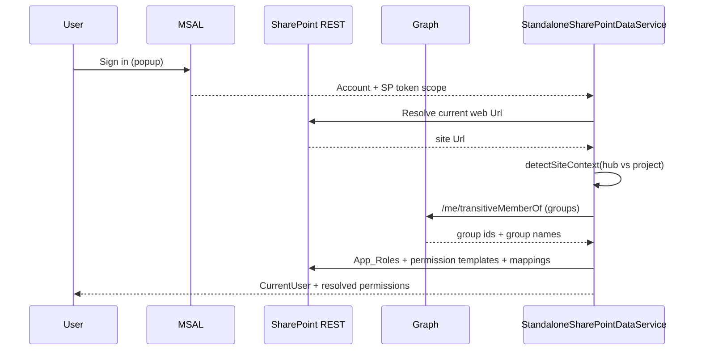

# Standalone Mode (Vite/Webpack Dev + MSAL + Graph RBAC)

## Purpose and Scope
Standalone mode allows running HBC Project Controls outside SPFx workbench while preserving the same `IDataService` contract, RBAC semantics, and permission-engine behavior used in SharePoint mode.

Scope:
- Standalone authentication bootstrap (`dev/auth/*`)
- Standalone `SharePointDataService` delegation (`StandaloneSharePointDataService`)
- Graph-assisted role resolution for the 14-role matrix
- Hub vs project site auto-detection

Out of scope:
- Replacing SharePoint list-level security controls
- Interactive AAD login in CI

## Three-Mode Compatibility Matrix

| Mode | Entry point | Auth | Data service | Notes |
|---|---|---|---|---|
| `mock` | `dev/index.tsx` | none | `MockDataService` | default local mode |
| `standalone` | `dev/index.tsx` | MSAL browser | `StandaloneSharePointDataService` | Graph RBAC + project/hub detection |
| `sharepoint` | `src/webparts/...WebPart.ts` | SPFx implicit | `SharePointDataService` | production SPFx packaging path |

## Runtime Flow (Standalone Auth + Graph RBAC)

## Required Environment Variables

| Variable | Required | Description |
|---|---|---|
| `VITE_DATA_SERVICE_MODE` | yes | `mock` or `standalone` |
| `VITE_AAD_CLIENT_ID` | standalone | Azure AD app client ID |
| `VITE_AAD_TENANT_ID` | standalone | Tenant ID |
| `VITE_SP_HUB_URL` | standalone | Hub site URL |
| `VITE_APPINSIGHTS_CONNECTION_STRING` | optional | App Insights telemetry |
| `VITE_SP_SITE_URL` | optional | Force standalone target site URL (defaults to hub) |

## Graph Permissions
Minimum for standalone RBAC validation:
- `User.Read`
- `Group.Read.All`

Additional permissions may exist for other features (calendar, mail, chat), but RBAC group resolution depends on `Group.Read.All` consent.

## Verification Commands
Run in this order for standalone changes:

1. `npm run validate:standalone-env`
2. `npm run verify:standalone`
3. `npm run test --workspace=packages/hbc-sp-services -- StandaloneRbacResolver`
4. `npm run test:e2e -- playwright/mode-switch.spec.ts playwright/offline-mode.spec.ts playwright/standalone-auth.spec.ts`
5. `npm run build:app` (SPFx regression guard)

## Troubleshooting

### Popup blocked or cancelled
- Symptom: login button returns immediate auth error.
- Action: allow popups for localhost and retry.

### Missing Graph consent
- Symptom: standalone loads but group-based role matching is incomplete.
- Behavior: app falls back to email-based role matching from `App_Roles.UserOrGroup`.
- Action: grant admin consent for `Group.Read.All`.

### Role mismatch
- Check `App_Roles` entries for:
  - group name exact match,
  - user email fallback,
  - active flag.
- Verify security-group mapping table has active `defaultTemplateId` for expected role group.

### Offline behavior
- Standalone keeps shell/UI responsive while network drops.
- Offline toast indicates live-data features may be unavailable.

## Security Boundaries and Audit Notes
- Browser RBAC is a UX and workflow guard; SharePoint permissions remain the true data boundary.
- Standalone blocks cross-tenant site-origin mismatch relative to configured hub URL.
- Graph group fetch failures fail soft and preserve deterministic fallback behavior.
